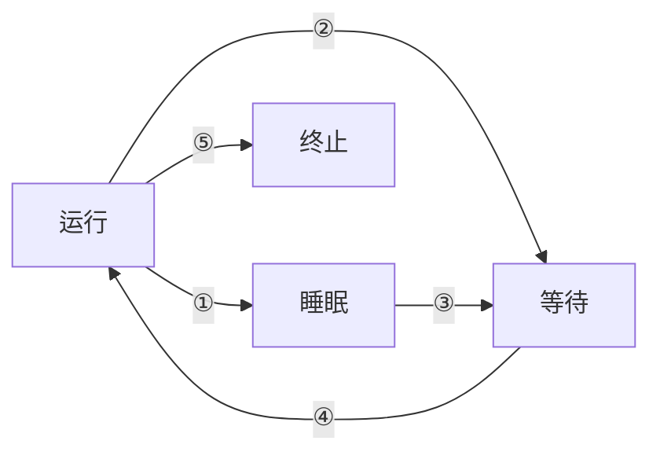
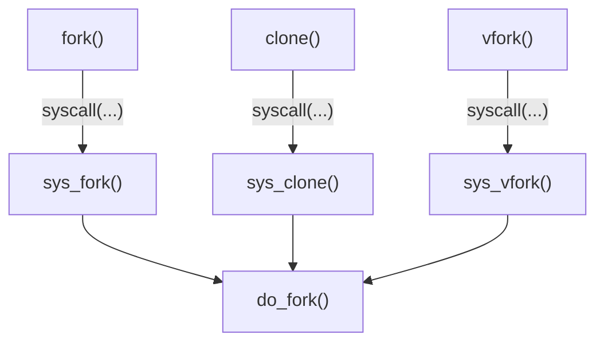

# Material

-   [Linux CFS 调度器：原理、设计与内核实现](https://arthurchiao.art/blog/linux-cfs-design-and-implementation-zh/) 
-   [Linux Load Average：算法、实现与实用指南](https://arthurchiao.art/blog/linux-loadavg-zh/) 

# 1 相关概念

## 1.1 状态转换



## 1.2 进程表示

`include/linux/sched.h:struct task_struct` 是 Linux 内核中表示进程（或线程）的核心结构体，其内容非常庞大，用于跟踪调度、内存管理、信号处理、I/O、审计、调试等众多方面的状态。

```c
struct task_struct {    
    /* 调度相关字段 */
	unsigned int      __state;               /* 任务当前状态（TASK_RUNNING、TASK_INTERRUPTIBLE 等）*/ 
	int               prio;                  /* 动态优先级 */
	int               static_prio;           /* 静态优先级 */
	int               normal_prio;           /* 常规优先级 */
	unsigned int      rt_priority;           /* 实时优先级 */
	struct sched_entity      se;             /* sched_entity，CFS 调度实体 */
	struct sched_rt_entity   rt;             /* sched_rt_entity，RT 调度实体 */
	struct sched_dl_entity   dl;             /* sched_dl_entity，Deadline 调度实体 */
	const struct sched_class *sched_class;   /* 指向调度策略类，比如 CFS、RT、DL */
    unsigned int             policy;         /* 调度策略（SCHED_NORMAL、SCHED_FIFO 等）*/
    int               on_cpu;                /* 是否在CPU上 */
    int               on_rq;                 /* 是否在运行队列上 */
    int               recent_used_cpu;       /* 最近使用的 CPU */
	int               wake_cpu;              /* 唤醒时选择的 CPU */
    struct sched_statistics  stats;          /* 统计调度数据 */
    int               nr_cpus_allowed;       /* 下面4个是 CPU 亲和性掩码 */
	const cpumask_t   *cpus_ptr;
	cpumask_t         *user_cpus_ptr;
	cpumask_t         cpus_mask;
    struct uclamp_se uclamp_req[UCLAMP_CNT]; /* 下面2个是能耗控制相关（UClamp）*/
	struct uclamp_se uclamp[UCLAMP_CNT];


    /* 线程 & 栈 */
    struct thread_info   thread_info;        /* 存放低级线程信息 */
    void                 *stack;             /* 线程的内核栈指针 */
	refcount_t           usage;              /* 引用计数 */
	unsigned int         flags;              /* 进程标志（PF_*）*/
	unsigned int         ptrace;             /* ptrace 调试标志 */
    struct restart_block restart_block;      /* 用于支持系统调用重启 */


    /* RCU、PSI、Preempt、IO Wait 等协作相关 */
#ifdef CONFIG_TASKS_RCU
	unsigned long    rcu_tasks_nvcsw;       /* RCU 读者跟踪和排队支持 */
	u8               rcu_tasks_holdout;
	u8               rcu_tasks_idx;
	int              rcu_tasks_idle_cpu;
	struct list_head rcu_tasks_holdout_list;
#endif /* #ifdef CONFIG_TASKS_RCU */
    unsigned        sched_remote_wakeup:1;  /* 是否由远程 CPU 唤醒 */
    unsigned        in_execve:1;            /* 下面3个标识当前 task 是否处于特殊状态 */
	unsigned        in_iowait:1;
    unsigned        in_memstall:1;
    unsigned int    psi_flags;              /* PSI 内存/CPU 压力相关标志 */
    
    
    /* 进程间关系（父子、线程组等）*/
    pid_t				pid;                /* 线程 ID */
	pid_t				tgid;               /* 进程组 ID */
	struct task_struct __rcu *real_parent;  /* 真实父进程 */
	struct task_struct __rcu *parent;       /* 当前父进程 */
	struct list_head         children;      /* 子进程链表 */
	struct list_head         sibling;       /* 兄弟进程链表 */
	struct task_struct       *group_leader; /* 指向线程组组长 */
	struct list_head         thread_group;  /* 所在线程组链表 */
	struct list_head         ptraced;       /* 被谁 ptrace */
	struct list_head         ptrace_entry;  /* ptrace 目标链表 */


    /* 退出状态和信号处理 */
    int                     exit_state;     /* 退出时状态 */
	int                     exit_code;      /* 退出时代码 */
	int                     exit_signal;    /* 退出时信号 */
	int                     pdeath_signal;  /* 父进程退出时发出的信号 */
	unsigned long           jobctl;         /* 作业控制字段 */
    struct signal_struct        *signal;    /* 下面3个是信号处理的主体结构体指针 */
	struct sighand_struct __rcu *sighand;
    struct sigpending           pending;
	sigset_t                blocked;        /* 下面3个是信号阻塞掩码 */
	sigset_t                real_blocked;
	sigset_t                saved_sigmask;    
    
    
    /* 权限、身份验证、安全模块 */
	const struct cred __rcu *ptracer_cred;  /* 下面3个是权限凭据 */
	const struct cred __rcu *real_cred;
	const struct cred __rcu *cred;
    struct seccomp          seccomp;        /* 下面2个是系统调用过滤与调度 */
	struct syscall_user_dispatch syscall_dispatch;
	struct audit_context *audit_context;    /* 审计日志信息*/
	kuid_t               loginuid;          /* 下面2个是登录会话相关标识 */
	unsigned int         sessionid;
    
    
    /* 内存管理（MM）*/
	struct mm_struct        *mm;            /* 当前进程的地址空间描述符 */
	struct mm_struct        *active_mm;     /* 当前活动的 mm，内核线程使用 */
	struct task_rss_stat    rss_stat;       /* RSS 统计 */
	unsigned long           min_flt;        /* 次要缺页异常统计 */
	unsigned long           maj_flt;        /* 主要缺页异常统计 */
	struct reclaim_state *reclaim_state;    /* 回收页面状态 */
    struct mempolicy	 *mempolicy;        /* NUMA 相关的内存策略 */
	unsigned long   *numa_faults;           /* 下面3个是 NUMA 平衡页迁移相关字段 */
	unsigned long   total_numa_faults;
	unsigned long   numa_faults_locality[3];    
    
    
    /* 文件系统与文件描述符表 */
	struct fs_struct        *fs;            /* 文件系统上下文（如 cwd, umask）*/
	struct files_struct     *files;         /* 打开的文件描述符表 */
	struct nameidata        *nameidata;     /* 用于路径解析的数据结构 */    
    
    
    /* 执行信息 & 运行时间 */
	char            comm[TASK_COMM_LEN];    /* 可执行文件名 */
	u64				start_time;             /* 启动时刻（单调时钟）*/
	u64				start_boottime;         /* 启动时刻（boot 基准）*/
	u64				utime;                  /* 用户态时间 */
	u64				stime;                  /* 内核态时间 */
	u64				gtime;
	struct prev_cputime		prev_cputime;   /* 上次记录的 CPU 时间 */
	struct vtime			vtime;          /* 用于精确的虚拟 CPU 统计 */

    
    /* 同步 & 锁 */
	spinlock_t          alloc_lock;         /* 用于同步进程字段访问的锁 */
	raw_spinlock_t      pi_lock;    
	struct mutex        futex_exit_mutex;   /* futex 退出同步 */
    struct rt_mutex_waiter *pi_blocked_on;  /* 下面2个是锁等待状态追踪（如 rt_mutex）*/
	struct mutex_waiter    *blocked_on;    
    
    
    /* I/O 子系统相关 */
    struct io_context		*io_context;    /* 块设备 I/O 上下文 */
	struct bio_list			*bio_list;      /* 下面2个是 BIO 队列与栈插入优化 */
	struct blk_plug			*plug;    
    struct io_uring_task    *io_uring;      /* io_uring 支持 */
    unsigned			use_memdelay:1;     /* blk-cgroup 内存延迟相关 */
    
    
    /* 调试与内核特性支持字段 */
 	unsigned long   stack_canary;           /* 栈溢出保护哨兵值 */   
    unsigned int    in_ubsan;               /* 用于检测未定义行为（UBSan）*/
	unsigned int    hardirq_threaded;       /* 下面2个是中断上下文追踪 */    
	int             softirq_context;    
    unsigned		in_page_owner:1;        /* page_owner 检测递归 */
    unsigned long   preempt_disable_ip;     /* 上一次关闭抢占的位置 */
    void				*journal_info;      /* journaling 文件系统状态 */
    
    
    /* cgroup、命名空间等容器化支持 */
    struct nsproxy			*nsproxy;       /* 所属命名空间指针（如 pid/mnt/ns）*/
	struct css_set __rcu	*cgroups;       /* 控制组信息 */
	struct list_head		cg_list;        /* 是否禁止 cgroup 迁移 */
};
```

# 2 进程创建



## 2.1 do_fork()

>   在 Linux 内核 6.1 及更高版本中，用 kernel_clone() 代替了 do_fork()。
>


# 3 系统调用

## 3.1 进程复制


## 3.2 内核线程


## 3.3 启动新程序


## 3.4 退出进程


# 4 进程调度


# 5 Misc

## 5.1 /proc/loadavg


## 5.2 /proc/stat


