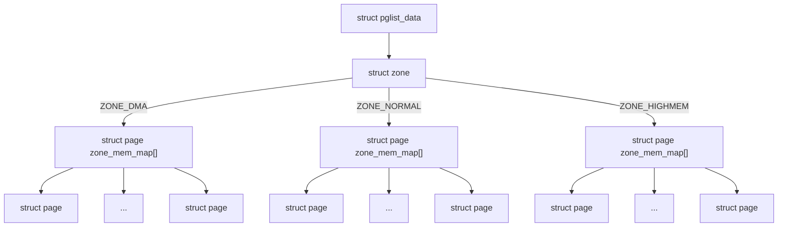
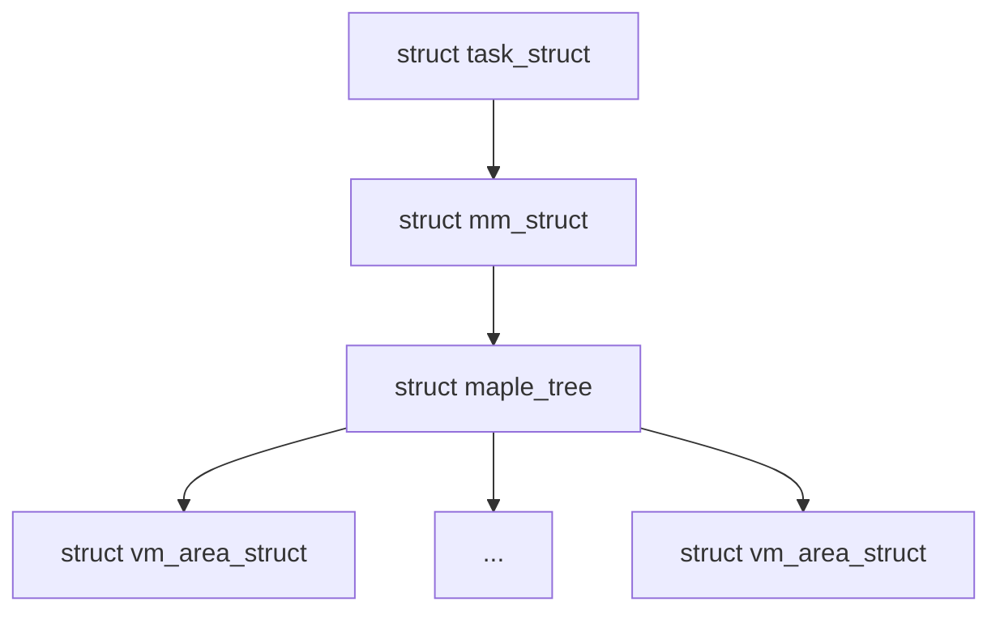
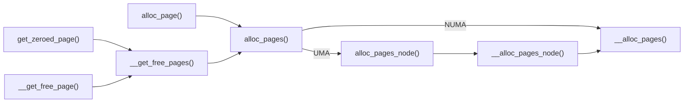
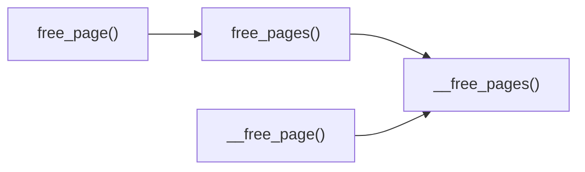
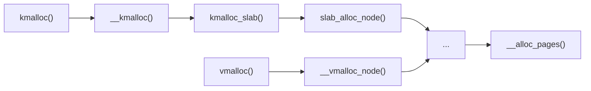
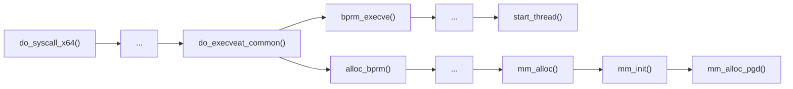

# Material

-   [Linux物理内存描述](http://ilinuxkernel.com/?p=1332) 
-   [Linux物理内存页面分配](http://ilinuxkernel.com/?p=1371) 
-   [Local and Remote Memory: Memory in a Linux NUMA System](http://ilinuxkernel.com/?p=1378) 
-   [Linux内存地址映射](http://ilinuxkernel.com/?p=1276) 
-   [Linux内核在x86_64 CPU中地址映射](http://ilinuxkernel.com/?p=1303) 

# 1 相关概念

## 1.1 (N)UMA模型

-   UMA模型（一致内存访问，uniform memory access）：将可用内存以连续方式组织起来（可能有小的缺口）。SMP系统中的每个处理器访问各个内存区的速度都是一样的。
-   NUMA模型（非一致内存访问，non-uniform memory access）：系统的各个CPU都有本地内存，可支持特别快速的访问。各个处理器之间通过总线连接起来，以支持对其他 CPU的本地内存的访问，比访问本地内存慢些。


Linux 根据访问内存的速度是否一致，定义了 **节点（Node）** 的概念。节点通过 `struct pglist_data` 结构体来表示，这个结构体后面章节有详细的介绍。

### 1.1.1 UMA 节点

在 UMA 模型中，所有的物理内存被认为是统一访问时间的，因此系统中只存在一个节点，编号为 `0`。UMA模型的节点定义了一个全局变量 `mm/memblock.c:contig_page_data`，并通过 `NODE_DATA(0)` 来使用它

```c
/* include/linux/mmzone.h */
#ifndef CONFIG_NUMA
extern struct pglist_data contig_page_data;
static inline struct pglist_data *NODE_DATA(int nid)
{
    return &contig_page_data;
}
#endif
```

### 1.1.2 NUMA节点

在 NUMA 模型中，内核使用一个数组或指针数组来管理多个 `pglist_data`，每个节点对应一个 `pglist_data`，通过 `NODE_DATA(nid)` 获取。

```c
/* arch/x86/mm/numa.c */
struct pglist_data *node_data[MAX_NUMNODES] __read_mostly;
```

## 1.2 逻辑-虚拟-物理

-   逻辑地址
    -   是在机器语言指令中，来说明操作数和指令的地址；每个逻辑地址包括两部分：段（Segment）和偏移量（Offset）
    
-   虚拟地址
    -   **一般内存分配**：通过 `kmalloc()`、`kmem_cache_alloc()` 等函数分配内存时，返回的是虚拟地址。内核代码使用这些虚拟地址进行访问。
    -   **内存映射 I/O**：通过 `ioremap()` 等函数将物理设备的地址映射到虚拟地址空间。
-   物理地址
    -   **DMA 操作**：使用 `dma_alloc_coherent()` 等函数分配内存，返回的是物理地址，设备通过 DMA 直接访问这些物理地址。
    -   **硬件设备访问**：某些设备驱动可能需要直接使用物理地址来访问设备内存或进行低级硬件操作。


## 1.3 内存信息查看

```bash
$ cat /proc/zoneinfo        # 显示每个 Zone 的详细信息
$ cat /proc/pagetypeinfo    # 显示每种页类型的可用情况
$ cat /proc/buddyinfo       # 伙伴系统的状态
```

## 1.4 Huge Pages

Linux 中的 Huge Pages（大页）是一种用于提高内存访问效率的机制，广泛应用于需要大量内存并频繁访问的场景，例如数据库、虚拟化、科学计算等。一个 Huge Page 通常大小为 2MB 或 1GB。


# 2 内存相关struct

## 2.1 物理内存



### 2.1.1  struct pglist_data

`include/linux/mmzone.h:struct pglist_data` 还有一个别名 `pg_data_t` ，用来描述一个节点（Node）。可以通过 `NODE_DATA(nid)`  访问当前 CPU 所在节点的 `pglist_data` 。

```c
typedef struct pglist_data {
    struct zone       node_zones[MAX_NR_ZONES];      /* 该节点上的所有内存区域（zone），如 DMA/Normal/HighMem */
    struct zonelist   node_zonelists[MAX_ZONELISTS]; /* 页面分配器使用的 zone 路径链表 */
    int               nr_zones;                      /* 当前节点中实际被初始化的 zone 数量 */
    unsigned long     node_start_pfn;                /* 该节点内存的起始页帧号（PFN） */
    unsigned long     node_spanned_pages;            /* 该节点内所有 zone 覆盖的总页数（含 holes） */
    unsigned long     node_present_pages;            /* 该节点中实际存在（online）的页数 */
    struct page       *node_mem_map;                 /* 指向该节点所拥有页框的 struct page 数组基址 */
    int               node_id;                       /* 该节点的编号 */
    wait_queue_head_t pfmemalloc_wait;               /* 内存紧张时，pfmemalloc 机制的等待队列 */
    spinlock_t        lru_lock;                      /* 保护 LRU 列表（页面回收相关）用的自旋锁 */
    ...
} pg_data_t;
```

### 2.1.2 struct zone

节点（Node）下面可以有多个区域， 每个区域的类型不同，用 `include/linux/mmzone.h:zone_type` 表示

```c
enum zone_type {
    ZONE_DMA,     /* 提供给某些只能访问低地址内存的设备（通常为 < 16MB）。主要用于 DMA 设备需要的缓冲区 */
    ZONE_DMA32,   /* 为只能访问 32 位地址（<4GB）的设备提供内存 */
    ZONE_NORMAL,  /* 内核的主工作区。用于分配常规内存（内核堆、页表、结构体等）*/
#ifdef CONFIG_HIGHMEM
    ZONE_HIGHMEM, /* 高端内存：无法直接线性映射到内核地址空间，需要临时映射。仅 32 位系统使用 */
#endif
    ZONE_MOVABLE, /* 可移动页，用于页迁移、内存热插拔等 */
#ifdef CONFIG_ZONE_DEVICE
    ZONE_DEVICE,  /* 专供设备内存管理（如 NVDIMM、GPU）使用 */
#endif
    __MAX_NR_ZONES
};
```

对一台 64GB 内存机器而言，Linux 内核可能会将物理内存划分为如下所示的布局。你也可以通过将 `dmesg` 命令的结果重定向到文件中后，查找 `Zone ranges:` 关键字对应的内容就是系统实际的 zone 布局。

```bash
[   0   - 16MB  ]  ->  ZONE_DMA
[  16MB - 4GB   ]  ->  ZONE_DMA32
[  4GB  - 64GB  ]  ->  ZONE_NORMAL
[      移动页    ]  ->  ZONE_MOVABLE
```

`include/linux/mmzone.h:struct zone` 用于管理该 zone 内的物理页框（`struct page`）的分配、回收、迁移等。

```c
struct zone {
    unsigned long          _watermark[NR_WMARK];   /* 内存水位线，触发页回收、kswapd 等机制的先决条件 */
    unsigned long          watermark_boost;        /* 用于内存回收时动态调高水位，以缓解内存紧张 */
    unsigned long          nr_reserved_highatomic; /* 为高优先级分配（GFP_ATOMIC）保留的页数 */
    long                   lowmem_reserve[MAX_NR_ZONES];  /* 为高 zone（如 ZONE_NORMAL）保留内存，
                                                             防止被低 zone（如 ZONE_DMA）抢光 */
    struct per_cpu_pageset *per_cpu_pageset;       /* 每个 CPU 的本地页缓存，减少锁竞争，提高性能 */

    struct pglist_data     *zone_pgdat;            /* 指回所属的 struct pglist_data（即 NUMA 节点）*/
    struct page            *zone_mem_map;          /* 指向该 zone 的起始 struct page 数组 */
    
    struct free_area       free_area[MAX_ORDER];   /* 按 2^order 管理的 free list（伙伴系统）*/
    ...
};
```

### 2.1.3 struct page

`struct page` 是 Linux 内核中用于描述每一页物理内存的核心数据结构。它在物理内存管理（包括页面分配、换页、缓存管理等）中起着基础性作用。在虚拟内存场景下，在 32 位系统下启用了高端内存时，使用非常频繁且关键。

```c
struct page {
    unsigned long flags;               /* 页的状态标志 */
    struct folio *folio;               /* 指向所属 folio（5.18 之后逐步引入）*/
    union {
        struct address_space *mapping; /* 映射地址空间（文件页、页缓存）*/
        void *s_mem;                   /* Slab 页的对象空间起始地址 */
        ...
    };
    union {
        pgoff_t index;                 /* 页在文件中的偏移（page cache）*/
        void *freelist;                /* 用于 Slab 分配器 */
    };
    union {
        struct list_head lru;          /* LRU 链表 */
        struct {                       /* 或者用于 Slab 链表 */
            struct page *next;
        };
    };
    atomic_t _mapcount;                /* 页被映射的次数（匿名映射）*/
    atomic_t _refcount;                /* 页的引用计数 */
    ...
    struct zone *zone;                 /* 所属 zone（间接编码，某些内核不直接暴露）*/
};
```

`struct page`是内核在启动时为 **所有物理页一次性分配的大块结构体数组**，如：`memblock_alloc(sizeof(struct page) * nr_pages, ...);`  

## 2.2 虚拟内存



### 2.2.1 struct vm_area_struct

`include/linux/mm_types.h:struct vm_area_struct` 是操作系统中管理进程虚拟地址空间的核心数据结构，用于描述进程地址空间中一段**连续**的**虚拟内存**区域。每个VMA代表具有相同属性（如权限、映射类型等）的内存段，支持高效的内存管理和保护机制。

```c
struct vm_area_struct {
    unsigned long vm_start;     /* 虚拟地址空间中的起始地址 */
    unsigned long vm_end;       /* 虚拟地址空间中的结束地址 */

    struct mm_struct *vm_mm;    /* 指向所属进程的内存描述符 struct mm_struct，关联到进程的整个地址空间 */
    
    
    struct file * vm_file;      /* 文件映射，指向关联的 struct file 对象；匿名映射（如堆、栈）时此字段为 NULL */
    unsigned long vm_pgoff;     /* 文件映射的页偏移量（以页大小 PAGE_SIZE 为单位），对应于mmap()的最后一个参数。
                                   例如，vm_pgoff=2 表示从文件的第 3 页开始映射 */
    unsigned long vm_flags;     /* 控制内存区域的共享性、可执行性等行为(如 VM_READ|VM_WRITE|VM_EXEC|VM_SHARED) */
    struct vm_operations_struct *vm_ops; /* 操作函数集 */
    void * vm_private_data;     /* 用于存储 VMA 的私有数据 */
    ...
}
```

### 2.2.2 struct mm_struct

`include/linux/mm_types.h:struct mm_struct` 结构是描述内存管理的基本单位，`include/linux/sched.h:struct task_struct` 结构中会包含它。

```c
struct task_struct {
    ...
    struct mm_struct *mm;        /* 当前用户进程拥有的地址空间 */
    struct mm_struct *active_mm; /* 当前用户进程实际使用的地址空间，包括内核线程+继承自前一个任务 */
    ...
};
```

`mm_struct` 通过 `struct maple_tree` 与 `vm_area_struct` 关联在一起。

```c
struct mm_struct {
    struct maple_tree mm_mt;
    unsigned long     mmap_base;
    unsigned long     mmap_legacy_base;
    pgd_t             *pgd;
}
```

# 3 初始化内存管理

`init/main.c:start_kernel()` 中与内存管理相关的初始化如下

```c
asmlinkage __visible void __init __no_sanitize_address start_kernel(void)
{
    ...
    page_address_init();                  /* 初始化页框到虚拟地址的映射缓存 */
    setup_arch(&command_line);            /* 早期体系结构初始化函数 */
    setup_per_cpu_areas();                /* 初始化每个 CPU 分配独立的内存区域（per-CPU 数据）*/
    build_all_zonelists(NULL);            /* 初始化所有 zone 的 zonelist 链表 */
    page_alloc_init();                    /* 处理与 per-CPU page 相关的准备工作 */
    mm_init();                            /* 进一步初始化内核内存子系统 */
    setup_per_cpu_pageset();              /* 初始化每个 CPU 的 per-CPU 页面缓存 */
    ...
}
```

## 3.1 page_address_init

从 Linux 6.0 的源码以及gdb调试追踪来看，这个函数最终实现为空，估计是为了兼容以前的代码。

```c
#define page_address_init()  do { } while(0)
```

## 3.2 setup_arch

`arch/x86/kernel/setup.c:setup_arch()` 负责体系结构相关的初始化函数，其主要任务包括：

-   硬件基础检测与初始化
-   内存管理初始化
-   引导参数解析
-   中断与异常处理
-   体系结构特有配置

下面会重点关注与内存管理相关部分的实现。

### 3.2.1 init_mem_mapping

`arch/x86/mm/init.c:init_mem_mapping()`  建立物理内存到内核虚拟地址的直接映射，将物理地址 `0x0` 到 `max_pfn << PAGE_SHIFT` 映射到内核虚拟地址空间的 `PAGE_OFFSET` 起始区域。

这其中最关键的调用是 `memory_map_bottom_up()` 或 `memory_map_top_down()` ，它会遍历内存区域，逐段调用 `init_memory_mapping()`。最终将已经被内核页表映射的物理页帧号区间保存到 `arch/x86/mm/init.c:pfn_mapped[]` 中。

```c
void __init init_mem_mapping(void)  /* 只罗列关键步骤 */
{
    probe_page_size_mask();         /* 探测 CPU 支持的页大小（如 2MB/1GB 大页）*/
    
#ifdef CONFIG_X86_64
    end = max_pfn << PAGE_SHIFT;    /* 64 位使用 max_pfn（所有物理内存）*/
#else
    end = max_low_pfn << PAGE_SHIFT;/* 32 位使用 max_low_pfn（低端内存）*/
#endif
    
    init_memory_mapping(0, ISA_END_ADDRESS, PAGE_KERNEL); /* 初始化 ISA 地址范围 [0,0x100000] */
    init_trampoline();              /* 初始化跳板页表（用于 KASLR 偏移）*/
    
    
    if (memblock_bottom_up()) {     /* 自底向上映射 */
        unsigned long kernel_end = __pa_symbol(_end);
        memory_map_bottom_up(kernel_end, end);
        memory_map_bottom_up(ISA_END_ADDRESS, kernel_end);
    } else {                        /* 自顶向下映射, X86进入的是这个分支 */
        memory_map_top_down(ISA_END_ADDRESS, end);
    }
    ...
}
```

### 3.2.2 initmem_init

`arch/x86/mm/numa_64.c:initmem_init()` 初始化系统的 NUMA 结构、节点内存信息、距离矩阵等，为后续调度器和内存分配器提供 NUMA 拓扑信息支持。

### 3.2.3 paging_init

`setup_arch()` 中调用的 `x86_init.paging.pagetable_init()` 实际实现是在 `arch/x86/mm/init_64.c:paging_init()` ，初始化内核页表（页目录/页表），初始化 zone 大小（DMA, DMA32, Normal, HighMem），建立高地址映射等。`mm/page_alloc.c:free_area_init()` 做了大量初始化和日志信息的打印，可以详细看看。

```c
void __init paging_init(void)
{
    sparse_init();                  /* 初始化稀疏内存模型所需要的结构体和数据 */
    node_clear_state(0, N_MEMORY);  /* 清除 Node 0 的内存状态标志 */
    node_clear_state(0, N_NORMAL_MEMORY);
    zone_sizes_init();              /* 建立并初始化系统中所有节点的 zone（如 DMA、Normal、HighMem）布局 */
}
```

#### 3.2.3.1 zone_sizes_init

```c
void __init zone_sizes_init(void)
{
    unsigned long max_zone_pfns[MAX_NR_ZONES];

    memset(max_zone_pfns, 0, sizeof(max_zone_pfns));

#ifdef CONFIG_ZONE_DMA
    max_zone_pfns[ZONE_DMA]     = min(MAX_DMA_PFN, max_low_pfn);
#endif
#ifdef CONFIG_ZONE_DMA32
    max_zone_pfns[ZONE_DMA32]   = min(MAX_DMA32_PFN, max_low_pfn);
#endif
    max_zone_pfns[ZONE_NORMAL]  = max_low_pfn;
#ifdef CONFIG_HIGHMEM
    max_zone_pfns[ZONE_HIGHMEM] = max_pfn;
#endif

    free_area_init(max_zone_pfns);   /* 初始化各个 zone 的管理结构 */
}
```

## 3.3 setup_per_cpu_areas

`arch/x86/kernel/setup_percpu.c:setup_per_cpu_areas()` 是 Linux 内核启动阶段的重要函数之一，其主要作用是为每个 CPU 分配和初始化 per-CPU（每 CPU 私有）数据区域，并设置相应的访问机制。

 `__per_cpu_offset[]` 记录了每个 CPU 的 per-CPU 数据块相对于基地址的偏移，供 `__percpu` 变量访问使用。

## 3.4 build_all_zonelists

`mm/page_alloc.c:build_all_zonelists()` 会（重新）构建系统中的所有 **zone 列表（zonelists）**。

```c
struct zoneref {
	struct zone *zone;  /* 指向实际的 zone */
	int zone_idx;       /* zone 在节点中的索引，如 ZONE_NORMAL */
};
struct zonelist {
	struct zoneref _zonerefs[MAX_ZONELISTS * MAX_NR_ZONES + 1];
};
```

每个 `pg_data_t`（代表一个 NUMA 节点）包含多个 `zonelist`，每个 zonelist 表示某种内存分配策略（如 `GFP_KERNEL`）的搜索路径。

```c
pg_data_t->node_zonelists[0] → zonelist
                             ├── zoneref: ZONE_NORMAL (当前节点)
                             └── zoneref: ZONE_NORMAL (其他节点)
```

## 3.6 mm_init

`init/main.c:mm_init()` 完成早期内存系统初始化，包括页扩展机制、调试与硬化工具、堆栈收集、分配器（SLAB/SLUB）、vmalloc 映射、内存泄露/越界检测，以及页表和 PTI 安全机制，标志着内核正式启用完整内存管理体系。

### 3.5.1 mem_init

`arch/x86/mm/init_64.c:mem_init()` 启用伙伴系统（buddy allocator），正式开始物理页分配。

```c
void __init mem_init(void)
{
    pci_iommu_alloc();         /* 分配 IO 内存管理单元相关页表和数据结构 */

    memblock_free_all();       /* memblock 阶段管理的内存被释放，加入到伙伴系统的 free_area[] 中 */
    after_bootmem = 1;         /* 完成 bootmem 到 buddy 系统过渡的标记 */
    
    x86_init.hyper.init_after_bootmem(); /* 确保虚拟化环境下的后续页表/内存操作是安全的 */
    ...
}
```

#### 3.6.1.1 free_area[] 初始化

每个页通过伙伴系统的 `__free_one_page()` 被挂到 `zone->free_area[]` 上，对应于不同 order 的页块。

```c
mem_init()
 └── memblock_free_all()
      └── free_low_memory_core_early()
           └── __free_pages_core()
                └── __free_pages()
                     └── __free_one_page()
```

### 3.5.2 kmem_cache_init

`mm/slub.c:kmem_cache_init()` 是 Linux 内核启动时内存分配子系统中 **SLUB 分配器** 的初始化核心函数之一。它主要完成 SLUB 的基础元数据结构初始化，使内核后续能够通过 `kmalloc` 等机制动态分配内存。

```c
void __init kmem_cache_init(void)
{
    ...
    /* 建立 kmalloc 系统 cache */
    setup_kmalloc_cache_index_table();
    create_kmalloc_caches(0);
    ...
}
```

### 3.5.3 pgtable_init

`include/linux/mm.h:pgtable_init()` 是启动页表机制（比如页表锁、页表缓存）的一环。

```c
static inline void pgtable_init(void)
{
    ptlock_cache_init();    /* 页表锁缓存初始化 */
    pgtable_cache_init();   /* 页表结构缓存初始化 */
}
```

### 3.5.4 vmalloc_init

`mm/vmalloc.c:vmalloc_init()`  初始化内核虚拟地址映射（vmalloc）区域的关键结构，用于支持 `vmalloc()`、`vmap()` 等接口。

## 3.6 setup_per_cpu_pageset

`mm/page_alloc.c:setup_per_cpu_pageset()` 初始化每个 zone 的 per-CPU pageset，并为每个节点分配每 CPU 的 node 级统计结构体（per_cpu_nodestat），为后续高效的页分配与内存事件统计做好准备。

# 4 物理内存的管理

## 4.1 伙伴系统

Linux 内核中的伙伴系统（Buddy System）是用来管理空闲的物理页面的，两个大小相等且邻接的内存块被称作伙伴。

一个简易版的实现：[https://github.com/liushupeng/LinuxKernel/tree/master/memory/buddy](https://github.com/liushupeng/LinuxKernel/tree/master/memory/buddy) 

### 4.1.1 System Storage

在区域（zone）的数据结构中，有个数组 `free_area[MAX_ORDER]` 来保存每个空闲内存块链表。

```c
struct zone {
    ...
    struct free_area       free_area[MAX_ORDER];   /* 按 2^order 管理的 free list（伙伴系统）*/
    ...
};
```

#### 4.1.1.1 空闲页面的组织

`free_area` 里保存的是 **物理地址连续 **的 $2^{order}$ 个空闲页面，空闲页面的组织如下图所示。


#### 4.1.1.2 空闲页面链表

需要注意的一点是，每个空闲页面链表上各个元素（大小相同的连续物理页面），是通过 `struct page` 中的双链表成员变量来连接。

##### 4.1.1.2.1 free_area初始化

`free_area` 的初始化是通过 `mm/page_alloc.c:zone_init_free_lists()` 来实现。

```c
static void __meminit zone_init_free_lists(struct zone *zone)
{
    unsigned int order, t;
    for_each_migratetype_order(order, t) {
        INIT_LIST_HEAD(&zone->free_area[order].free_list[t]);
        zone->free_area[order].nr_free = 0;
    }
}
```

它的函数调用栈如下：

```bash
(gdb) bt
#0  zone_init_free_lists (...) at ../mm/page_alloc.c:6934
#1  0xffffffff824f4171 in init_currently_empty_zone (...) at ../mm/page_alloc.c:7338
#2  0xffffffff824d317a in free_area_init_core (...) at ../mm/page_alloc.c:7848
#3  0xffffffff824d3a83 in free_area_init_node (nid=0x0) at ../mm/page_alloc.c:7939
#4  0xffffffff824d3ea1 in free_area_init (...) at ../mm/page_alloc.c:8396
#5  0xffffffff824c452a in zone_sizes_init () at ../arch/x86/mm/init.c:1038
#6  0xffffffff824c497a in paging_init () at ../arch/x86/mm/init_64.c:827
#7  0xffffffff824b5489 in setup_arch (...) at ../arch/x86/kernel/setup.c:1253
#8  0xffffffff824ad103 in start_kernel () at ../init/main.c:959
#9  0xffffffff824ac496 in x86_64_start_reservations (...) at ../arch/x86/kernel/head64.c:556
#10 0xffffffff824ac541 in x86_64_start_kernel (...) at ../arch/x86/kernel/head64.c:537
#11 0xffffffff81000145 in secondary_startup_64 () at ../arch/x86/kernel/head_64.S:358
#12 0x0000000000000000 in ?? ()
```

##### 4.1.1.2.1 free_area赋值

`free_area` 的赋值是通过 `mm/page_alloc.c:__free_one_page()` 来实现。

```c
static inline void __free_one_page(struct page *page, unsigned long pfn,
                                   struct zone *zone, unsigned int order,
                                   int migratetype, fpi_t fpi_flags)
{
    ...
done_merging:
    set_buddy_order(page, order);

    if (fpi_flags & FPI_TO_TAIL)
        to_tail = true;
    else if (is_shuffle_order(order))
        to_tail = shuffle_pick_tail();
    else
        to_tail = buddy_merge_likely(pfn, buddy_pfn, page, order);

    if (to_tail)
        add_to_free_list_tail(page, zone, order, migratetype);
    else
        add_to_free_list(page, zone, order, migratetype);
}
```

它的函数调用栈如下：

```bash
(gdb) bt
#0  __free_one_page (...) at ../mm/page_alloc.c:1115
#1  0xffffffff811debc3 in __free_pages_ok (...) at ../mm/page_alloc.c:1725
#2  0xffffffff811df59b in __free_pages_core (...) at ../mm/page_alloc.c:1757
#3  0xffffffff824d2d25 in memblock_free_pages (...) at ../mm/page_alloc.c:1821
#4  0xffffffff824d4458 in __free_pages_memory (...) at ../mm/memblock.c:2038
#5  0xffffffff824d449a in __free_memory_core (...) at ../mm/memblock.c:2054
#6  0xffffffff824d464f in free_low_memory_core_early () at ../mm/memblock.c:2096
#7  0xffffffff824d4e23 in memblock_free_all () at ../mm/memblock.c:2134
#8  0xffffffff824c498a in mem_init () at ../arch/x86/mm/init_64.c:1338
#9  0xffffffff824ad058 in mm_init () at ../init/main.c:843
#10 0xffffffff824ad221 in start_kernel () at ../init/main.c:997
#11 0xffffffff824ac496 in x86_64_start_reservations (...) at ../arch/x86/kernel/head64.c:556
#12 0xffffffff824ac541 in x86_64_start_kernel (...) at ../arch/x86/kernel/head64.c:537
#13 0xffffffff81000145 in secondary_startup_64 () at ../arch/x86/kernel/head_64.S:358
#14 0x0000000000000000 in ?? ()
```

#### 4.1.1.3 空闲页面示例

假设我们的系统内存只有32个页面RAM，物理页面使用情况和空闲内存页面组织如下图。

-   order=0的链表（大小 $2^0$ 个页面）上共有5个结点
-   order=1的链表（大小 $2^1$ 个页面）上共有3个结点
-   order=3的链表（大小 $2^3$ 个页面）上共有1个结点
-   其他链表为空


### 4.1.2 Buddy Allocator

#### 4.1.2.1 页面分配过程

现在上层请求分配4个地址连续的空闲物理页面块。 分配页面块步骤如下：

-   先从 order = 2 的空闲块链表上开始找空闲的块；由于没有空闲块；会到上一级order查找是否有空闲块；
-   从 order = 3 的链表上开始查找，有一个空闲结点；但该链表上的每个节点块大小 为 8 个页面，分配4个页面给上层，标记该页面表为已使用；
-   将该剩下的4个页面，放入order=3的链表上；
-   更新相关统计信息；


### 4.1.3 Buddy Free

#### 4.1.3.1 页面回收过程

现在上层释放了一个物理页面，回收页面块步骤如下：

-   标记该页面块为空闲；
-   检查相邻物理页面是否为空闲；若相邻物理页面为空闲，则尝试合并成更大的连 续物理页面块（这样可以避免内存碎片化）；
-   若有合并，则要更新freearea[] 中链表元素；
-   更新相关统计信息。


## 4.2 页面分配

| APIs                         | 描述                                              |
| ---------------------------- | ------------------------------------------------- |
| alloc_page(gfp_mask)         | 分配一个页面，返回页面数据结构                    |
| alloc_pages(gfp_mask, order) | 分配 $2^{order}$ 个页面，返回第一个页面的数据结构 |
| __get_free_page(gfp_mask)    | 分配一个页面，且返回页面的逻辑地址                |
| __get_free_pages(gfp_mask)   | 分配 $2^{order}$ 个页面，且返回页面的逻辑地址     |
| get_zeroed_page(gfp_mask)    | 分配 1 个页面，数据清零、且返回逻辑地址           |



无论UMA架构还是NUMA架构，最终都会调用到 `mm/page_alloc.c:__alloc_pages()` 函数。

### 4.2.1 __alloc_pages

```c
struct page *__alloc_pages(gfp_t gfp,            /* 分配标志: Get Free Page */
                           unsigned int order,   /* 请求的页阶数，表示分配 2^order 个连续页 */
                           int preferred_nid,    /* 首选的 NUMA 节点 ID */
                           nodemask_t *nodemask) /* NUMA 节点掩码 */
{
    ...
    page = get_page_from_freelist(alloc_gfp, order, alloc_flags, &ac); /* 首先尝试快路径: freelist */
    if (likely(page)) {goto out;}
    
    page = __alloc_pages_slowpath(alloc_gfp, order, &ac);              /* 失败则走慢路径: 回收/压缩/OOM */
out:
    ...                                          /* 记账 / KMSAN 初始化 */
    return page;
}
```

### 4.2.2 get_page_from_freelist

```c
struct page *get_page_from_freelist(gfp_t gfp_mask, unsigned int order,
                                    int alloc_flags, const struct alloc_context *ac)
{
    ...
    /* 遍历 zonelist 中的 zone */
    for_next_zone_zonelist_nodemask(zone, z, ac->highest_zoneidx, ac->nodemask) {
        ...
        /* 水位判断，不能满足要求的话做回收处理 */   
        mark = wmark_pages(zone, alloc_flags & ALLOC_WMARK_MASK);
        if (!zone_watermark_fast(zone, order, mark, ac->highest_zoneidx, alloc_flags, gfp_mask)) {
            ...
            ret = node_reclaim(zone->zone_pgdat, gfp_mask, order);
        }
        
        /* 从 free list 中真正尝试拿出一个 page 并进行初始化 */
        page = rmqueue(ac->preferred_zoneref->zone, zone, order, gfp_mask, alloc_flags, ac->migratetype);
        if (page) {
            prep_new_page(page, order, gfp_mask, alloc_flags);
            return page;
        }
    }
}
```

### 4.2.3 __alloc_pages_slowpath

```c
struct page *__alloc_pages_slowpath(gfp_t gfp_mask, unsigned int order, struct alloc_context *ac)
{
    ...
    /* 如果必要，唤醒kswapd线程在后台回收内存 */
    if (alloc_flags & ALLOC_KSWAPD) {
        wake_all_kswapds(order, gfp_mask, ac);
    }
    
    /* 再尝试快速路径分配 */
    page = get_page_from_freelist(gfp_mask, order, alloc_flags, ac);
    if (page) {goto got_pg;}
    
    /* 高阶页优先尝试紧缩(compaction)分配 */
    if (can_direct_reclaim &&
        (costly_order || (order > 0 && ac->migratetype != MIGRATE_MOVABLE)) &&
        !gfp_pfmemalloc_allowed(gfp_mask)) {
		page = __alloc_pages_direct_compact(gfp_mask, order,
						alloc_flags, ac,
						INIT_COMPACT_PRIORITY,
						&compact_result);
		if (page)
			goto got_pg;
    }

retry:
    /* 各种手段轮番上阵: reclaim, compact, oom，循环的等到合适大小的内存 */
    ...
    page = __alloc_pages_direct_reclaim(gfp_mask, order, alloc_flags, ac, &did_some_progress);
    if (page) {goto got_pg;}
    
    page = __alloc_pages_direct_compact(gfp_mask, order, alloc_flags, ac, compact_priority, &compact_result);
    if (page) {goto got_pg;}
    
    if (should_reclaim_retry(gfp_mask, order, ac, alloc_flags, did_some_progress > 0, &no_progress_loops))
        goto retry;
    
    page = __alloc_pages_may_oom(gfp_mask, order, ac, &did_some_progress);
    if (page) {goto got_pg;}
    ...
}
```

## 4.3 页面回收

| APIs                      | 描述                                          |
| ------------------------- | --------------------------------------------- |
| __free_pages(page, order) | 释放 $2^{order}$ 个页面，第一个参数为物理地址 |
| __free_page(addr)         | 释放第一个参数指定的物理地址的内存            |
| free_pages(addr, order)   | 释放 $2^{order}$ 个页面，第一个参数为逻辑地址 |
| free_page(addr)           | 释放第一个参数指定的逻辑地址的内存            |



### 4.3.1 __free_pages

 `mm/page_alloc.c:__free_pages()` 函数用于释放一组以 `page` 为首，由 $2^{order}$ 个页组成的页框。

```c
void __free_pages(struct page *page,   /* 要释放的起始页的 struct page */
                  unsigned int order)  /* 页的阶数（即一共释放 2^order 个页）*/
{
    if (put_page_testzero(page)) {     /* 原子性地将页的引用计数(_refcount) 减 1，确保内存不在使用中 */
        free_the_page(page, order);
    } else if (!PageHead(page)) {      /* 不能整体释放整个 2^order 块（可能页被拆用），则尝试逐个释放后续的小块 */
        while (order-- > 0) {
            free_the_page(page + (1 << order), order);
        }
    }
}
```

### 4.3.2 free_the_page

```c
static inline void free_the_page(struct page *page, unsigned int order)
{
    if (pcp_allowed_order(order)) {              /* 对单页内存（order == 0），快速回收到当前 CPU 的 */
        free_unref_page(page, order);            /* per_cpu_pages freelist 中，避免全局锁开销 */
    } else {
        __free_pages_ok(page, order, FPI_NONE);  /* 释放到伙伴系统 */
    }
}
```

`__free_pages_ok()` 做释放前的准备工作，核心工作是 `__free_one_page()` 来做的。

### 4.3.3 __free_one_page

```c
static inline void __free_one_page(struct page *page,
        unsigned long pfn,
        struct zone *zone, unsigned int order,
        int migratetype, fpi_t fpi_flags)
{
    ...
    while (order < MAX_ORDER - 1) {
        ...
        /* 清理 buddy（合并）*/
        if (page_is_guard(buddy))
            clear_page_guard(zone, buddy, order, migratetype);
        else
            del_page_from_free_list(buddy, zone, order);
        
        /* 合并页块并继续向上合并 */
        combined_pfn = buddy_pfn & pfn;
        page = page + (combined_pfn - pfn);
        pfn = combined_pfn;
        order++;
    }
    
done_merging:
    set_buddy_order(page, order); /* 更新合并后的最终阶 */
    ...
    if (to_tail)                  /* 根据不同策略，确定将页放在尾部还是首部 */
        add_to_free_list_tail(page, zone, order, migratetype);
    else
        add_to_free_list(page, zone, order, migratetype);
    ...
}
```

## 4.4 gfp_t

GFP（Get Free Page）标志决定内存分配器和 kswapd 分配和回收页面时的行为，也就是指定在哪些区域申请内存、申请什么样的内存、用作什么 用途等。是定义在 `include/linux/gfp_types.h` 中的一系列宏。

| 标志位            | 标志位含义                                                   | 组合标志 |
| ----------------- | ------------------------------------------------------------ | -------- |
| __GFP_WAIT        | 内存申请可以被中断。即此时可以调度其他进程运行，也可以 被更重要的事件中断；进程也可以被阻塞。 | N        |
| __GFP_HIGH        | 该请求非常重要，即内核紧急需要内存。若内存申请失败给内 核带来严重影响甚至崩溃，就通常使用该标志。内存申请不允 许不允许中断（该标志与 HIGHMEM 无关） | N        |
| __GFP_IO          | 在尝试找到空闲内存之前，可以执行磁盘 I/O 操作                | N        |
| __GFP_FS          | 允许执行文件系统 I/O 操作，该标志避免在 VFS 层应用，因为 可能会带来死循环递归调用 | N        |
| __GFP_COLD        | 要求使用冷页                                                 | N        |
| __GFP_NOWARN      | 分配失败不产生告警信息                                       | N        |
| __GFP_REPEAT      | 分配失败后，会尝试几次再分配，再失败，就停止                 | N        |
| __GFP_NOFAIL      | 分配失败反复尝试，直到成功                                   | N        |
| __GFP_NORETRY     | 分配失败，不再尝试                                           | N        |
| __GFP_NO_GROW     | Slab 机制内部使用                                            | N        |
| __GFP_COMP        | 用于大页面                                                   | N        |
| __GFP_ZERO        | 分配的页面用零填充                                           | N        |
| __GFP_NOMEMALLOC  | 不要使用用作紧急使用的页面                                   | N        |
| __GFP_HARDWALL    | 只在 NUMA 中有效，限制进程在节点上的内存分配，该进程 绑定在指定 CPU 上运行。若进程运行在所有 CPU 上运行（这 是默认值），该标志无效 | N        |
| __GFP_THISNODE    | 只在 NUMA 中有效，内存只能在当前节点或指定节点上进行         | N        |
| __GFP_RECLAIMABLE | 该内存分配后，可以被回收                                     | N        |
| __GFP_MOVABLE     | 该内存分配后，可以被移动                                     | N        |
| GFP_ATOMIC        | 用于原子内存分配操作，即任何情况下不允许被中断，且可能 会使用 “紧急保留” 内存 | Y        |
| GFP_NOIO          | 不允许 I/O 操作，但可以被中断                                | Y        |
| GFP_NOFS          | 不允许 VFS 操作，但可以被中断                                | Y        |
| GFP_KERNEL        | 用于内核空间内存申请，该标志是内核代码中最常用的标志         | Y        |
| GFP_USER          | 用于用户空间内存申请                                         | Y        |
| GFP_HIGHUSER      | 对 GFP_USER 的扩展，表示可以使用高端内存区域                 | Y        |
| GFP_IOFS          | 用于 VFS 的 I/O 操作                                         | Y        |
| GFP_THISNODE      | `__GFP_THISNODE|__GFP_NOWARN|__GFP_NORETRY`                  | Y        |
| GFP_DMA           | 用于 DMA 操作                                                | Y        |
| GFP_DMA32         | 用于 DMA32 操作（x86_64 架构中）                             | Y        |

# 5 虚拟内存的管理

## 5.1 虚拟内存相关API

| APIs                                     | 描述                                                         |
| ---------------------------------------- | ------------------------------------------------------------ |
| kmalloc()                                | 内核空间返回一块虚拟内存，且物理地址和虚拟地址都保证连续，最大分配大小通常小于 128 KB |
| kmem_cache_create() / kmem_cache_alloc() | Slab 分配器为相同大小的对象创建cache，这个大小一般限制在8K~32K，依系统而异 |
| mempool_create()                         | 内存池接口，保证关键路径（如中断、I/O 等）中的内存分配请求不会失败 |
| vmalloc()                                | 内核空间返回一块虚拟内存，虚拟地址连续但物理地址不一定连续   |



## 5.2 mmap

实验例子：https://github.com/liushupeng/LinuxKernel/tree/master/memory/mmap 

## 5.3 地址映射

回顾一下地址映射的过程。不管是内核态还是用户态，都要必须遵守CPU架构的地址映射模型，也就是说无论是内核态还是用户态，都会用到页面映射关系表。


这其中涉及到的组件关系如下


### 5.3.1 段式转换

段式转换是值逻辑地址到虚拟地址的转换过程，这一过程中用到的关键寄存器：CS、SS、GDTR。过程如下： 

（1）根据指令的性质来确定应该使用哪一个段寄存器，例如转移指令中的地址在代码段，而取数据指令中的地址在数据段；

（2）段存器的高13位即为段选择码，结合着GDTR寄存器的值，可以从GDT中找到程序所在的段的详细信息： 段基址、段Limit等等；

（3）段基址+逻辑地址即为最终的虚拟地址； 逻辑地址就是我们平常写代码打印出来的那个地址

```c
{
    unsigned long tmp  = 0x12345678;
    fprintf(stdout, "tmp address:0x%08lX\n", &tmp);  // 这个结果就是逻辑地址
}
```

（4）在这之前会做一些校验：根据段limit确认是否越界， 根据指令的性质和段描述符中的访问权限来确定是否越权；

#### 5.3.1.1 CS/SS寄存器

内核在建立一个进程时会将段寄存器（CS, DS, SS等）设置好，它实现在 `arch/x86/kernel/process.c:start_thread()` 。

有一点需要声明一下：现代 x86-64 用户空间段寄存器大多数**被忽略了**，只用 CS/SS，其它段寄存器（DS/ES/FS/GS）基本没有作用，从代码中也可以看到这几个寄存器被置为0了。

```c
void start_thread(struct pt_regs *regs, unsigned long new_ip, unsigned long new_sp)
{
    /* 把 __USER_DS 赋值给 SS, 而 DS 值置为 0 */
    start_thread_common(regs, new_ip, new_sp, __USER_CS, __USER_DS, 0);
}

void start_thread_common(struct pt_regs *regs, unsigned long new_ip, unsigned long new_sp,
                         unsigned int _cs, unsigned int _ss, unsigned int _ds)
{
    loadsegment(fs, 0);       /* FS 置为 0 */
    loadsegment(es, _ds);     /* ES 置为 0 */
    loadsegment(ds, _ds);     /* DS 置为 0 */
    load_gs_index(0);         /* GS 置为 0 */

    regs->ip        = new_ip;
    regs->sp        = new_sp;
    regs->cs        = _cs;    /* CS 置为 __USER_CS=0x33，包含CS段选择码 */
    regs->ss        = _ss;    /* SS 置为 __USER_DS=0x2b，包含DS段选择码 */
    regs->flags     = X86_EFLAGS_IF;
}
```

#### 5.3.1.2 GDTR寄存器

GDTR 保存着 GDT（全局描述符表）的基地址和大小，初始化在 `arch/x86/kernel/head_64.S` 中

```assembly
lgdt    early_gdt_descr(%rip) ; 把 early_gdt_descr 所指向的 GDT 描述符加载到 GDTR 寄存器中
```

`early_gdt_descr` 是 `struct desc_ptr` 结构的，赋值位置同样是在  `arch/x86/kernel/head_64.S` 

```assembly
struct desc_ptr {
    unsigned short size;      ; GDT 的长度（单位是字节）- 1
    unsigned long address;    ; GDT 表的物理地址
} __attribute__((packed)) ;

SYM_DATA(early_gdt_descr,            .word GDT_ENTRIES*8-1)   ; 设置 desc_ptr.size 为GDT表的大小(bytes)减1
SYM_DATA_LOCAL(early_gdt_descr_base, .quad INIT_PER_CPU_VAR(gdt_page)) ; 设置 desc_ptr.address
```

### 5.3.2 页式转换

页式转换是值虚拟地址到物理地址的转换过程，这一过程中用到的关键寄存器：CR3。过程如下： 

（1）从CR3寄存器中获取页面目录（Page Directory）的基地址； 

（2）以线性地址的dir位段为下标，在目录中取得相应页面表（Page Table）的基地址； 

（3）以线性地址中的page位段为下标，在所得到的页面表中获得相应的页面描述项； 

（4）将页面描述项中给出的页面基地址与线性地址中的offset位段相加得到物理地址。

上述是32bit的映射过程，只有2级映射关系。64bit的地址格式会更复杂一些，需要4级映射关系，但主要逻辑是类似的。

#### 5.3.2.1 CR3寄存器

CR3 保存了当前正在使用的页表的物理地址，从而控制虚拟地址到物理地址的映射。每个进程都是用 `task_struct` 来表示的，其中的 `struct mm_struct *mm` 字段指向了该进程的所需要的内存结构。`mm_struct` 结构体中的 `pgd_t * pgd` 字段保存的就是该进程的CR3寄存器的值。

```c
static inline int mm_alloc_pgd(struct mm_struct *mm)
{
    mm->pgd = pgd_alloc(mm);
    if (unlikely(!mm->pgd))
        return -ENOMEM;
    return 0;
}
```

在进程切换时，会将新进程的 `pdg` 字段加载到CR3寄存器。这块逻辑实现在 `arch/x86/mm/tlb.c:switch_mm()` 

```c
void switch_mm(struct mm_struct *prev, struct mm_struct *next, struct task_struct *tsk)
{
    local_irq_save(flags);
    switch_mm_irqs_off(prev, next, tsk);
    local_irq_restore(flags);
}

void switch_mm_irqs_off(struct mm_struct *prev, struct mm_struct *next, struct task_struct *tsk)
{
    ...
    load_new_mm_cr3(next->pgd, new_asid, true);
    ...
}
```

### 5.3.3 映射实验

-   32bit: [https://github.com/liushupeng/LinuxKernel/tree/master/memory/addr32](https://github.com/liushupeng/LinuxKernel/tree/master/memory/addr32) 
-   64bit: [https://github.com/liushupeng/LinuxKernel/tree/master/memory/addr64](https://github.com/liushupeng/LinuxKernel/tree/master/memory/addr64) 

# 6 Misc

## 6.1 进程初始化内存

执行一个进程一般都是通过 `sys_execve()` 系统调用。在这个过程中会调用与该进程有关的初始化，同时也会调用与进程相关的初始化。内存管理和进程管理密不可分也在这儿有了更清晰的体现。大概的调用关系如下，`start_thread()` 和 `mm_alloc_pdg()` 两个函数我们前面都有涉及。



## 6.2 内存结构关系

内存管理中涉及很多的结构体，梳理了一下结构体之间的关系。从进程结构体task_struct开始，到物理内存 mem_map 结束。


