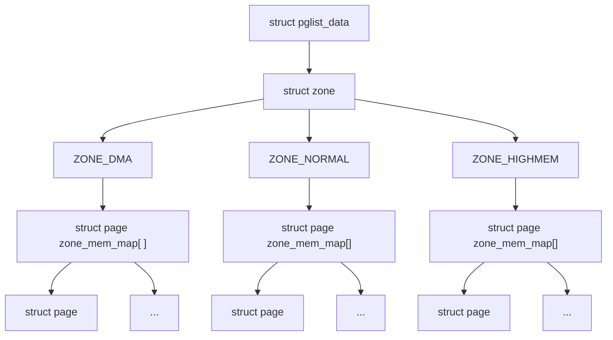
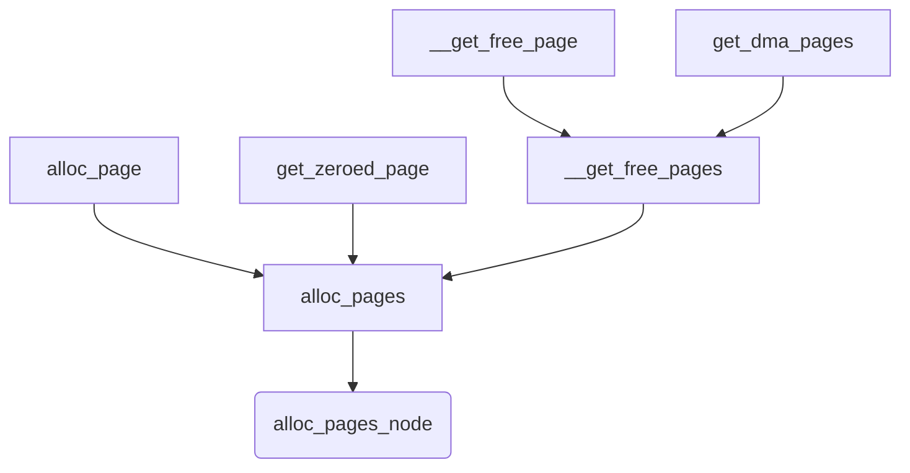
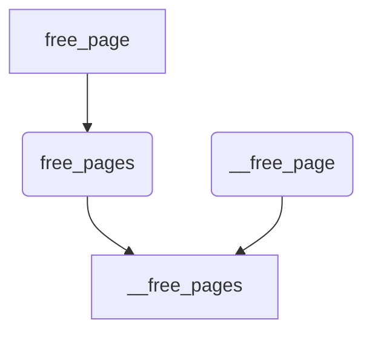

# 1 基本概念

## 1.1 (N)UMA模型

-   UMA模型（一致内存访问，uniform memory access）：将可用内存以连续方式组织起来（可能有小的缺口）。SMP系统中的每个处理器访问各个内存区的速度都是一样的。
-   NUMA模型（非一致内存访问，non-uniform memory access）：系统的各个CPU都有本地内存，可支持特别快速的访问。各个处理器之间通过总线连接起来，以支持对其他 CPU的本地内存的访问，比访问本地内存慢些。

<img src="data:image/jpeg;base64,/9j/4AAQSkZJRgABAQAAAQABAAD/2wBDAAUEBAUEAwUFBAUGBgUGCA4JCAcHCBEMDQoOFBEVFBMRExMWGB8bFhceFxMTGyUcHiAhIyMjFRomKSYiKR8iIyL/2wBDAQYGBggHCBAJCRAiFhMWIiIiIiIiIiIiIiIiIiIiIiIiIiIiIiIiIiIiIiIiIiIiIiIiIiIiIiIiIiIiIiIiIiL/wgARCADmA/gDAREAAhEBAxEB/8QAHAABAAICAwEAAAAAAAAAAAAAAAYHAQUDBAgC/8QAGAEBAQEBAQAAAAAAAAAAAAAAAAECAwT/2gAMAwEAAhADEAAAAPZYAAAAAAAAAAABrTZGvl7dzyqAAAAAAAAAAAAAAAAAAAAAAB05ebWeaXVm0AAAAAAABr471n0urNoAAAAAAAdaVrPZl1RtQAAADAAAAAAAAAAAMRApIo1PuvKvOXXc2WBvO1zoAAAAAAAAAAAAAAAAAAAAADrc9UptJd8bEx0pc21WxZyygAAAAAaPnurOvGW51M5aZ1N2WyZUAAAAAfOLSs3sO/ntHn0pg21WrZzygDIBgAAAAAAAAAAGIpKTd46bL0+aM8+vazbL02QAAAAAAAAAAAAAAAAAAAAAB0+O6h9fDWct3LnVbMYq2NXtSgAAAAARTj0jnp80R5dLZlhXWdLNuNPpQAAAAB8YtIdZ1My586rO8/u6tKu7KAMgGAAAAAAAAAAAYNGnWzvb9OfRxrW2S9QAAAAAAAAAAAAAAAAAAAAABw5uu6Y0WNTOo5lxakpUAAAAAAazOuxvnFs6mZFV7esSCaAAAAAA+ctNuabNmdR6Tr6SqUADIBgAAAAAAAAAjJWBrgbU2pFQfZNyJHKDalvgAAAAAAAAAAAAAAAAAAqAjABNyIHXBJDBrgbImJMQAAebzAMk6IEfRgnBDTiBg9JAAA0RUB1QbU25EwZJyRcA2xb4BgAAAAAAAAAgxHC0AV8fZPgV0SA+TanGUseiwAAAAAAAAAAAAAAAAAAedC+zkNSa80JYgICdMnAIQd0sgAAHm89IArc2pvjanAQU4CyAecD0eAACKEALeBXxyE9BXRLjREiOuU8eiADAAAAAAAAABBjQlrgrcFkArc25ujbnEeeT0WAAAAAAAAAAAAAAAAAADzoehjlNQaQ1JZAK3BZAK3BZAAAPN56QBW5tTfG1OAgpwFkA84Ho8AAEUIKXKCtwWQCtySnySU6xQJ6IAMAAAAAAAAAEGNAWqCuTJYoK4Nybo25xHnk9FgAAAAAAAAAAAAAAAAAA86HoM5TUmmNOWOCugWQCtwWQAADzIXECDE/NObI4T5I6TwFHHpgAAEUIIXGCuTJYoK4JOfJJTrFAnogAwAAAAAAAAAQY+joA3JuSGg5CcFfmQdItYAAAAAAAAAAAAAAAAAAFXHbALAISdUEqNQakG6NMWQAACriaA5DbGlANyRo4QRUtkAAEUNIAbk3JDQfZOyvTIOkWuAYAAAANMDSmTfnXN2ACDEKJKDSG7AIeT81p9mvNIXoAAAAAAAAAAAAcRGDjN4RomJHD5JaAAefCbn2a8lpXBKgdc1Jvga42RZAAAPMhcAIOWAaU2RwghROwVEemAAARQq4mYNKbswCHFlkXO8cJDz0AAYAAAAKlBUhktc4i4gAQY0Ja4K3BZAK3OUnxymoKdL5AAAAAAAAAAAANeeajiLlKyOQkZWB66AAPOh6GOU1BpDUlkArcFkArcFkAAA83npAFbm1N8bU4CCnAWQDzeekAAARQgpcoK3BZAK3NmSI2Z1igT0QAYAAAAKbOoRM1hODgL9ABBjQlrgrcFkArc5SfHKagp0vkAAAAAAAAAAAA6B58OI2ZviCH2bst4koAPOh6GOU1BpDUlkArcFkArcFkAAA83npAFbm1N8bU4CCnAWQDzeekAAARQgpcoK3BZAK3NmSI2Z1igT0QAYAAAAAAAAAIMaw+wdg3JHgdEnhEDJxHRLcAAAAAAAAAAAAAAAAAABThuTJxE6IEdgG6NScYNia8sgAAFKkhBknRAj6BNyCHIDRFzAAAihDzZA7BuyOA15YZCDkPk1BcYBgAAAAAAAAAgxojug+DamtBoSfEdPo6pqy5wAAAAAAAAAAAAAAAAAAUkSI+jrE3K5NwDtGpO4DILIAAB54J8DRlgEQO2fBvCAklBAT0OAACKEFN4D5NqawGgLGIedk+COF4AGAAAAAAAAACDkfLYBW5gskFcmSwDlNQU4XyZAAAAAAAAAAAAAAAAAAPO5f52TUGkNSWQYK5MFkArM5yxQADB5wPR5krc2xvDbHUIYdUsgwecD0eZAAImQYuUwVwCyAVwbEkRtDqFCnoUyDAAAAAAAAABCCOlsArg+SyQV0CwDlNSU4XyZAAAAAAAAAAAAAAAAAAPPBfh2jUGlNSWOCuAWOCsjtlhgAGDzgejwVubc3ZtjpEQOoWODzgejzIABEyDFyArcyWOCuDYEjNodIok9CGQYAAAAAAAAAIQRg2oOsb41QNUTUjh9nXNaXEZAAAAAAAAAAAAAAAAAAKQJEch1CakENiDYGqOUGTlLDAAMFDExBryxCDHOfBLCDnfMEULyMgAETICSEHXJAacGnJ+RA7BxGiLrMgwAAAAAAAAARoiR2gac3ANObgGmNyDXFrn0AAAAAAAAAAAAAAAAAAVUd0AA05uAADjN8S4AA+SpjaAwZBHSRAAGnLeMgAGgIOd8AA05uAADWlsn0DAAAAAAAAAAABWxZJgrYsoFbFkgAAAAAAAAAAAAAAAAAAAAAAFblkAAAAAAAAAFbFkgAAAAAAAAwVuWQZAAMgGAADBWx9gAAAAAAGDsk/MFbFlAqI2wAAAAAABxFmAAAAAAAAAAAAAAAFbljgAAAAAAAAFblkAAAAAAAAAFblkGQADIBgAAFallAAAAAAAAAwVsWUAAAAAAAACtiyQAAAAAAAAAAAAAACqzuGQAAAAAAAAQMngAAAAAAAAMHRLVMgAGQDAAAK1LKAAAAAAAABgrYsoAAAAAAAAFbFkgAAAAAAAAAAAAAAFblkAAAAAAAAAFbFkgAAAAAAAAwVuWQZAAMgFLHRBgyDWGzAAMEoLOMgA+TzkbkAwDWmzAANUXybIAArciBkAwa02YAAOyXUfYAAAAAAABRxxAAGsNmAAfJMixTIAPk83G3BgyYOkd0yACOF8EnAAIyU0d8GADpncMmDINKegTbApI3B1ytzcnybUHIdAl4PkpA9hn0AD4PPpMSLnQNefZJTbkMJ4YBWZYBcAABVZgyQQ4TrElBvCvCzADzyeyzvgAAAAAAAFGm+BGjBoDdGwN0QkmJzHwVAetTIAB59JcCCnGcBJAb8iZLgV4SsuwAAiZADbnwVqbc+DcGTJriYApsv4nYKSNwQo35Xx3DlMH0YLGB8lIHsM+gAfB59JiV0TgqM6hNyXlflnmAVmWCW+AAVWYMlcmDUmzOQsAqIuE+geej2Ud8AAAAAAAAo03wK6JoU8cJMSxitjvE8Pgp89bgAA8+kuBXRwGuNqfRYJWZaIK8JWXYAARMgBtyMn0Qs7J2QTYrMtwFNl/E7BSRuDXFYEiJ6Vkbg5zXFgA+SkD2GfQAPg8+kxIQdA2Z3CGlpkSJoYBWZYJb4ABVZgFbmrLUIUcBLCuS3D7B56PZR3wAAAAAAACjTfAro+jmPsjhbhUpOCRnwU+etwAAefSXArI1JbpAziLGIWTUFeErLsAAImQA250irDblkFZGyO2acskFNl/E7BSRuAAAADIPgpA9hn0AD4PPpMjAABkwZAKyLBLfAAKrAMGQYMgAyDzyeyjvgAAAAAAAFGm/B8mQDBkAyfBTx63AAMHnAlIMAAGTBkEBJyXYAARIrE2hgAyYABkFSHognYK/PPYAAAAAJ0eiDIAMHnogQAAAAAL8LHAANEeczSgAAAAHKesztgAAAAAAAFZlEAAAAAAsYv0AAwVMVcAAAAAZLjLHAAOEogiIAAAABynoEkwAAAAAAAAAAAAAAAAAAAAAAAAAAAAAAAAAAAAAAAAAAAAAAAAAAAAAAAAAAAAAAAP/EAEsQAAAFAwAECQgIBQIFBAMAAAIDBAUGAAEHERc3VhASExQVFlVXdQggMTU2QHR2GCE0OFBUcXMwMjNSciJBJVFid4MkQoWGYWNw/9oACAEBAAESAPeWV+bJG33Wsa0pYmsYMoRlPT03x1kVur0qAkbkYOOeenUFKkpShOOxhJoLDAP8PdHRGytCtydDwp0KMoRp5yRWQuREqkRwDkx4LGFG08yFqjwEY3paUkAtUgSJ7+4PT23R1nOc3tWWjQEcXlTwDCYAIyxWEAVtNhUvkLU1vTY1r1pRC91uOyMj+OvXpmtsVLl5tiUiUoRxxre4JHVtTrm1QWpRqS7GEnU+SJqjSIpU+rSkac48CcBn4BG5C/SBZKLc6a0qdndjURdYlG9E4OTuTc4tnJG3WKy7QpwVS3FjC4vYg2VurcUefeatREvmRELaAOaxM1jKXvoJK5GsSUJBDC7OTqp/0JmyPNaVmjqJCgRjQpyi7cVJ+GrjRkNyg0vRxyyxCDUskL4/+Ss4yBzWtZNnVi44yJQ6yeG42SrkC9nNGSYiThCtQlOCYJSkagIQisLSFtBOcmc+a07ktYIkeYlBZ8UFqXRNHOrLo9XWjsBcQQSBOmLJK02LLDYIf40vdT2KCvzqisC6lAgOUFWyitd3PBpJ69e1gs8GIAhKl75Jo3eOXJWtJwHF5TITbOLcnXgANUYqLsTpva8VbLzOXnzlEiclTNyIkLJe5qd+mCNivG3NyREjscsX/wAUV9ABXt6bWpyk74/+TM7SV0WtRAFTKpEYS6OUmhOCkzkgXNBhrcgShABUiAvRWJVjOD6BCEsbC5zk0AGohyWsUOU3spDIVehWSwgjTq9qVwrFqUKNKUhQkJUwRBIIBYAA+Zb3qNtjpIj8gsaId0Lcrkh4Vy+RQZSyOiN1g5pTc3WTDSvDbjqy8eBogBoEQBYNmS2AZC48aw5fnKJkWA50NK3HqliFG7/SJex2WtnO7R5JblmVI5I265T05AclXKCFY/8ADXP1Qs/ZFWNY+rleMIBZ4BYiPNiFMeBJP4o5xZrerIFemGrVTaaQ3P6Fxc0FkTassgLP0hUK8RtR7YzyZBGzkSJCjkS0qxWPkD0N4yRZC5NyVSY/DCM9vJUkNqcpwVBVqwF2Cao/i5I2Ty3whVUajR8obYuvkhJYWhrQlXRNj/GHaKPDQhuuupio5S2ms5EmY1MkThbTVPN2Q0P/AK22GkzpqajlmtYgTpAkmBCVilrfjsVjLaHhA3DNcl1+WBYViw2MFYQ9H13/AIg/6Q/0rGTAsl2KIgkcwWIjaLQeaRk+JuUbYJYe0K9EPcEhZhjY+JXJc3c1aVYEQj78U1XipmOaDZs2xo9KkSJJEaDRCkLzfIWTbpV7aSqG5JwGHtRCxK0piHRaFctLBYJqrzLe9R2Mpo4a8mJjjjROy8a86pjDU0zZDkClyeG64wXBZQzNKViYkLU3AuBEgIAnIAijCRFLnp/AaeJW7kkEmgjkAQRuVvL4QvdVqt0AWVo/DlRFlKQ4i4rhsaC4dMYYE8WibUxojDTUzamAnLMlOOGyWuzcscV7yWBGqLUjR0zw5CzNzykIPWCA7rjlp44VCUcIbV6ZEtcF5i9YNYeq/jP7OVIIy5tCgwZRLilMTDMbUBbW0pEJFxCKSkhJBd3xw1vMzaX5WvedLYfdSBBe2kN7U2QVC04+TxZItcikqcAggVQ2KJIVEUTG3HqlBKXjXuf/ABRW4wb2/wCdROOJ4jEW5iRHGnEIS+IEyY44bJsalu5r3kgkk8BpyamiIomez/yByoXTq0axReGwdFCwu10i5yXnuqu6o9R5tvdsgPauNYxk7228Tnra2HqSKc3+RMAEQZNmeJtCpYmCoAR1/O7/AODV1/O7/wCDUwvj9KHK6COZtiLkt4lzLkPhE3jLXdfIcsx1tQ2FYFz+v53f/Bq6/nd/8GoE7UGmgAVn2EDGO9GxzJRBIzTslMwCgW0jHZ7X2UiP16QGx4raLm9Y3Xv5gldY3Xv5glIHeYNE/hSVzl7RImSS3U20/gz4/SpbkOXIkEtaY0xxpEkPNO6/nd/8Grr+d3/wauv53f8AwakbHkVehIWIcmsh6VSWE0k5bMl7avUoV+eIWnWJTREnkdfzu/8Ag1dfzu/+DVHhzCWIzlMYy9GnROSPiGGux8rYFQEz7maJNp4wccJXWN17+YJXWN17+YJTQbLH9SMhhzLE3I8sHHGVi+RLpbimOvjvcq69eksYdfziVumNq5HK59OUl1sjXNiRH0k1745rrpJr3xzXQHNkuqTFKp9l9EBQeWQE93gHQTCvdnPJk9KQoExilQYB2aDSgjKmmaRgH6BdJNe+Oa6u5tW+WaqYYMCSx1A8s+TZ8cgXkBPIGrdoiiclqE7LuRxHoTxpj7dPQ/vaybXT0P72sm06KyOoK6TQnJk0cxtTmjSnEedMXVQxQGROyHiXVN7aoUk0fKJC1IGo2TZlibMrcURSwCTr+d3/AMGrr+d3/wAGphfH6UOd0EczZEnNbxLmXIe0s5jbSNxf8rx5uQF6LDU9fzu/+DV1/O7/AODVafHd/wDBqNjmSiCRmnZKZiyi7aRj6xuvfzBK6xuvfzBK6xuvfzBKQO8waMhQxG6S5pkTLJLKdAre7Zh2FzrwNXTImIU560KCSzdEKRV0Wg/JJa6LQfkktPiUhN5QkB5AgorS0u2msugCNBDADDpBeWNtdFoPySWui0H5JLWbkCMrCr8MpIQAelPoFlTYrOvAF1RqHRoyIswxx5oEMSIm9xdTIxu4zUfDIzZMbojrP/JUE9SeTr8Iq/B8jejP/wAuoKTtaDmpX/ok38lq6LQfkktSZsQ2iD1eyJNpshOrFWxSC+AIaxKhSntMtGemIMHeWO319FoPySWui0H5JLWOygE5FymAkAQAs9J6bWZsd/KEnfSzcjW8k0tXErqZGN3GaupkY3cZqTNDc0eUwhA1IEiIA4mpuO2CdgUO+Bt57V6hg/8A3OX8OatmgPGmussbEJ54AuqN+yTP8ETwK/sKj9sVYS2CQfwgisP+oZT82O/DLvUmYvmtn8/JWyGZ+CLKhKYhTl1HY8ks3RAWuui0H5JLXRaD8klp3SkJvKIhPIElFaWV001mQNhxJjCPeZprotB+SS10Wg/JJazmgRlYDmQy0hAB2bx1PNmcp8JVVBIhHD8axc05gaRmjakohj6mRjdxmpbDYzZuU6I6z6bFCqD+rfJ28NU1b3bMOwudeBq6j23z/wCkouGR/eEgHhLtWWvskK+bW3hzlsRf/wBU9ZU2KzrwBdUX9jWT4EngP+ym/wCF6gnqTydfhFX4Pkb0Z/8Al1BSf7KT/hbgk/sc9fAnVirYpBfAENYg9Syz5td+GAbScqeNJqjv3hJ/4S08J/3nG75SU1gnYFDvgbee1eoYP/3OX8OatmgPGmussbEJ54AuqN+yTP8ABE8Cv7Co/bFWEtgkH8IIrD/qGU/Njvwy71JmL5rZ/PyVshmfgiyoHteS/IDXwv33iYR4K6VmL2VYfmdp4c7bAJp4cOp5szlPhKqoBsvinhCXgXerVX7Qqg/q3ydvDVNW92zDsLnXgaumAVg58+vclFXKl/3hrlS/7w1IRWF5QkA8Jdqy39jhfza21ypf94a5Uv8AvDWcRg1JP9vh6ypsVnXgC6ov7GsnwJPAf9lN/wAL1BPUnk6/CKvwfI3oz/8ALqCk5pfNSf8AWH+S1cqX/eGpMYDqc9f6w/YTqxVsUgvgCGsQjBZmlnza71ypf94a5Uv+8NQDaRlTxpNUd+8JP/CWnhP+843fKSmsE7Aod8DbzwOaFmhsPXuyshGhT5MXiOUa4cc79RqtcOOd+o1WU8jwx/hSZtYpWxr15zy2cRNljYjPPAF1MGXMekRhqKOm8cAaBIUEYNcOOd+o1SnL+OhIz9E5jX1grCWwOD+EEVjGXxtnQStI7v7QhV2lTtpI1hwze6P1rDhm90fp/Xo3SLZdWNishWkNlbRxD/OyVshmfgiyoLteSfIDXXKl/wB4a5Uv+8NPgrC8omEeCulZj9lGH5maa5Uv+8NcqX/eGs6jBqBmnhw6nmzOU+EqqgGy+KeEJeBd6tVftCqD+rfJ28NU1b3bMOwudeBq6WY8iUya2dVKY83OakhEWWWbqMxnuQyVqMxnuQyVHMaw6IuY18ZjbY2rRl3Kue/R1olLOY2SJuTOKAwVhCT6jMZ7kMlajMZ7kMlE4RxsQeA4mFMoTCxWEG7i3pXZqWNziSE9EtJGQeTbBOO93q1F483fvWovHm796fmlCw5JxA1tCcCZAiOXEkEfgzKgSOuaMooHJMUqRKkDWUcRqMxnuQyVqMxnuQyVqMxnuQyUkSkIURCRESWQlTlhKKJX4bx67Oipe4w9nPWqzRHHnajMZ7kMlajMZ7kMlRqIsEOQHI4s0I2tMcZyphcixdD5Y93dX9mCpX3KCTc/UXjzd+9ai8ebv3qM40icOdjXKONAUi40m5Az8E7Aod8Dbz8T2R3gDpZysRcjrG61xIz/AGs9cSM/2s9EAj1lBfNgtXLca3EozickPleLyei/GriRn+1nriRn+1nriRn+1nonk+QL5vxOR4tuJSpjhKlYcctbI6apMHcRpnVyBdjxiurkC7HjFZYQNKDCa8DCkQpko3JuFo87JWyGZ+CLKRY7iMxh0XVymOtrmqIaU5QDtRmM9yGStRmM9yGSo5jSGxF0uvjMbbW1cIu5Vz36PtMnZjWuQt6dwbzrhuNPqMxnuQyVqMxnuQyUVhDGpJwDAQlj0gvptS1GQ4t6lEtLsalVFCKNLBgnHYAWACO6A1qLx5u/etRWPN370+NKJhydiJraCLJkCK68kgm38Q6TNhEySRo04VndWkGsKKXSZsbpU0MCs4QXN4AcYkKYMmxmTTZ4i7QtMMeWe5llRM6yZGMcEIDJYtGmsvGIJFn99QRiOL3p5O5BubyRHnmRSUtU1iyN+jqi6lsWcbkjPMzDsLnXgauj2AqX5hStToveSUCWIpFJZGpeOdoyutS8c7RldJYyRCs6xJGzOL2NI5tbiJSRmG5xsejqApYsSkuciQo1I9S8c7Rldal452jK6yZjtuiON3N8Y3aUFOKIZAiR5gXq2vCUxWtqg1MrIazhFHk4ajoyCxXcpX6K1LxztGV0+YhYUUcc1SdzlYTiEphgKaFR64fk8qlpwz1J6AZhp3vJ5wEyY086+gsoFxivBchx3I7Me5RJaJUmTncibWsmN6vV0w54Z0ChEYA494fUDDGFr45miLbUKYSo4yWZXikJY2h1kK08lE8B46QahamSNxy5QcACQkq5wzoLkFgyMzKHKKKTlCROfyAxIsjRpfklfCUq/TIkBHLnp/NnK1SgV56VoFByZUTH0AizicMx0ZABXcpX6K1LxztGV0+YhYUUcc1SZzldjiEppgKxoqPW4ghipacYepPZEZhp0LgiGaXlTm+uskGqBJXJMC2peOdoyutS8c7RldYqSXaZNkNlKWr1SFtdyQJbBiqaa5onhL05PoSGwKAKUnUvHO0ZXWpeOdoyuoM0BjOapUxoF7qe2gZkCkBWCdgUO+Bt54WxC9Q2HoHZIQsQqcmLwHJ9TeONxY3WpvHG4sbrKWNoXHoWmcmGKsqBeQ8tnEU5X2IzzwBdTBiDHh8YajToRHRmjSFCGPU3jjcWN0pw7jkKM/RBo59QKwlsEg/hBFYgxjB3zErK4vMSY1y9Rc8RynU3jjcWN1qbxxuLG6OQpWzAU6QoCCkyNLOOSII87JWyGZ+CLKbWEuYT9oaHVxeSm5FCG5USRqXjnaMrrUvHO0ZXSCNEQzPEZQs7i9jRuTQvGoIzNc68HQJiFatKFc+tqU4epeOdoyutS8c7RldZQx03RHFMifmJ3lJLm2pbnpjcoKj0OG5qqRHmkKiGRYYUcz4gYFbCgUHucruacmLGOtS8c7RldKsNx4pEeMDlK9IAVFl6p0+j6tXnmqVZ6BUM0+38R2+9jGPlhZUy+8viv4J3qMaY9ma8pBoAQfkN2YF1eUNpkr7ODvSjhrEiIrOhvSbRFoYX9Y5W+J0x9YiPszT/ACdDOz3npNL5uYdhc68DV1Htvn/0lFwyP7wkA8Jdqy19khXza28OctiL/wDqnrN+wKceEnUm+yE/4W4JN7HvXwJ1R77N5OXhYvenr2ecvhTKwNpiDvCOzp5HAVb7isw+IX1lb7usv8APrIjCXKW3DDGd6HNEqTUvmK918jNAAoeiQvBJUbrBqNHGysloytBSBrkhpQaZzhtbPA8tKrDAN6mSo1Z52RvRn/5dQUn+yk/4W4JP7HPXwJ1Yq2KQXwBDWIPUss+bXfhgG0nKnjSaoftuyd/8ZwtH3kJZ8vNtYJ2BQ74G3ntXqGD/APc5fw5q2aA8aa6yxsQnngC6o37JM/wRPAr+wqP2xVhLYJB/CCKwZsPj36H8LpsTyF8+X8/JWyGZ+CLKge15L8gNfC/feJhHgrpWYvZVh+Z2nhztsAmnhw6y1sPnngC2o97KtPwZXAu9Wqv2hVB/Vvk7eGqat/En620QzlE5g7EKbx2zUrblSxK/o8keUHE3SJWUq2SNNy66tzVRlxcsO5lslTHlOiOZLHdupe2uT35LORpKe1rAOsuebLgJZLFwZJ8pgpE7lOIGGKMnHAeRDisZ+UpGlrAU5ms8obT0C43zMw7C514GrqPbfP8A6Si4ZH94SAeEu1Za+yQr5tbeHOWxF/8A1T1m/YFOPCTqTfZCf8LcEm9j3r4E6o99m8nLwsXvTyG42BxCG17iumMtaxUfcvogwxzQITbyKJFp3dKRG2B0k3kVSFtQoFIHJfdecQkm2WGCU4YdY4xFOSuVOzZdCBkkjMsRTbCCW5IzejDjylBrTHHT6SnVE1ApvGmt/UysB7ye7s2MM4gbUCwbi8yY5EiBM/J5YisKuSBmG8muiBt46MEBfD5JjiPu60owlYsQlDUF+Zkb0Z/+XUFJ/spP+FuCT+xz18CdWKtikF8AQ1iD1LLPm134YBtJyp40mqH7bsnf/GcLR95CWfLzbWCdgUO+Bt57V6hg/wD3OX8OatmgPGmussbEJ54AuqN+yTP8ETwK/sKj9sVYS2CQfwgisGbD49+h/C6bE8hfPl/PyVshmfgiyoHteS/IDXwv33iYR4K6VmL2VYfmdp4c7bAJp4cOstbD554AtqPeyrT8GVwLvVqr9oVQf1b5O3hqmre7Zh2FzrwNXSvHy14dmySMcsc2BfdmIQG26hTLvWfq6hTLvWfqZMdr0U2QyKQzF0f1KBMenSlTeIWmbKkR2c1TWpRLiVyZX1CmXes/V1CmXes/U64pf39sG2v+Sn1a2HCBc9NLY4nl8Ld4+tONJTuiUaYZoYBMe9V+rqFMu9Z+pTjmWrEZyZTlN9GQeC5YwuTKTGpvhVjSGDNIarKkZQ/wYcbTzDI+YI+tONITujS2JxmhgEx71X6uoUy71n6lOOZasRnplOU34ZB4LljDHGUmNRRoZEhhhqdqRkoyjCMXPbYudRx/Iby1o3FwUL7pOoUy71n6uoUy71n6oTChxG70ese1j04vKsKpUrdMcOZ00d3+PTV1YjXexNlJHUKZd6z9XUKZd6z9URgaqOyd1fXeSr35ycUxKURuCdgUO+Bt58HhrVNcbHpHrnehFK3RWnN1NsnbkyrU2yduTKgYYjnOUxqtdJVwE55Z4SHhpSPzC4NLmXc1C4pjEqgsvC7CSUAsp5mAAAtoCDU2yduTKtTTH23MaYWNDGo43szOVcpA3kBIILIwjGkZXIoHGUo02m9wEam2TtyZVqbZO3JlWRIk2QzA7k3MtlPImu6FSaPzslbIZn4IspDj1c7kR6SsUtc2BeOOo0B1uoUy71n6uoUy71n6mLHa9BNkkif5g6P6pCkOSpi5tEgTSNhbbr1LcaUrIWEK+oUy71n6uoUy71n6nvE8gkjEraH3Jr8qbFoOTUESRjJk8SeGJWYYUndURyM0xPjuXJUpRBGVH4BJILAAHqFMu9Z+ocAmBgBAHlV+o+OkRGbYXYERxpydrLWpgG292zDsLnXgaulUrl3WxBFoYgYTrksCdxOP5fL/AGdAq5fL/Z0Cpplc0R5JaI5NG6PAKd0apQQdkuQu8fYWq0cGjLcXV3StoDuh8rb3RSuh8rb3RSpg45QhUTVv6uRRhcQiGVx02RJEpiOMZG/oCyjFbYgNUEgLasrDKAPrdFa6HytvdFKckeVm5oWLbyuKjslIGdxLPKiRv+B3pdYAVbomPVnW/BnSSGQ6a5okJBAFJzWzNqgBIFWXhgCOzdA65fL/AGdAqXueW0DYqWHNsFuWmKEaK0QexyWCMD4aSEgx1bk6wRLG55Il57+qaH6NoECF6WtxBHQ+Vt7opXQ+Vt7opWOn6QOTnLmmWKECpYwuJaYClS7zp+ybKGWLuzE2oGIKSuh8rb3RSuh8rb3RSoY+SrWO/wAZl65qX3Qt6VaQowTsCh3wNvPaHl8bIA0oowvJblj3PnFANX1UyT3lIq6qZJ7ykVSgeQ4O1JXpXNkLqmA4o05qKfuythxfK3dsHYpc3NCpUnG1xOeL2VCsHlNxAJSQA3R1Infeq5UdDJ2UQYPWq46QBrF72ukuJIs8vBtjnFe3EnKDYIin02hCCQG5JWorrrm35t1Infeq5V1Infeq5U9uzw6YBlJUicruaxrlZSCyzzslbIZn4IspBK5fdewxaFoGE3kIuhcTj+Xy/wBnQKuXy/2dAqZpXM0uSmyNzRujwC3RCpVEH5NkLtG4imPjo0gHJa6I0BZvQ+Vt7opXQ+Vt7opUzccowiEO0kUyKLriWsm540s5e1MaxvJntAEoStra1KskKBDlZe1pVdpZFQWUEgN0dD5W3uilHteViSDTby2K34gaQSFTLHzBb8vAUWrc0yxScC3u2XdiczB/sY0KAVGf9ecuPfc5GDhkX3hIF4U61lr7BDfmpu4c37FH63w9Zs2AzXwo2k32Qn/C3BJvY96+BOph+ojyff8A9KEwFqt+DZE9OdQf7HMKEF6QjuY3pxX9Nyw8En9jnr4E6sVbF4V/+GRGGsQeoZN/1ydzHwwDaVlPxhNUP21ZLv4dwoB3K8oeXDtu4grB4LAwTEgf8kfns31scH/7hrjuHNWzW3jDZWVtis48DWBqM/XEWb4IngcR3LalYw+kJA71hgFi8GQwH+wGsmsG7E2D9DuFz2KT755ve/n5K2TS4P8Aezqg1AtriX5Ca+F8+8PDv+hlcazF7Js3/RIWwfDnXYFMvgBVljYfOfAllR364o0fBlcDmK4GdaK3pCQO9qh2gtLgAH+xSFUG1B9Hu2XNi8v8LPqK7a7/ACij4ZD94OB+FOlZZ9XQ/wCaEHDm7Yu/fqnrNWwKZ+FG0m+yE/4W4JN7HvXwJ1Mf9HAfwhtW/Bsh/wBfN3giGm31Wl/aDwSe9rQ56+BOrFexqGeDJKw/7PyL5kceDTaoDtKyj4umqH7aMlfq3cKP7wcv+XENYS2GxT4Tz2T1NBvn1bVr8Gadm1vGGysq7GJr4KrqMX0xBm+CJ4Ha+hlXfDmVh3YjD/DSawdsWYf0O4XLYrO/ne9W87JOymV+EqagW1tL8iNnC9/eGiXgy+sxeyTT4838OdNgkx+AFWVth838CWVHPZRo+DK4Hb1Gv+HHUR/o4D+EVUH+X3bLmxeX+Fn1dil6SWIZJEUzKrKUMKdEaVz7K3YUQrn2VuwohTaxzVyyeySCVpGNIlaUSogAMgxZdKWNvJZ1qZGvb3EhcQb0dlXeCJ10dlXeCJ1IYZkWVsJzM9yGN2QKRl3OvN41eWY+eo/ZSFMJzSiT2OLbMqgKAC0giddHZV3gidLmPKS9tVJD5DFbFKChFDpUyXjcmw0zXOsfdu5ymubb8GfGBVKpll1kQDKArXtKAkoZCrKpBACrMcRvxA2Dp59lbsKIU5Cyq4tKxENliIAKSRlXHC2c6OwFhZlYwDUNqAlKYNshk9jZ7qTG36PgblrietADo7Ku8ETro7Ku8ETqAxR3j6yRuEjXo1rm+KwKDbr4hMEM9fnyJvLMQS8hI5Qno7Ku8ETro7Ku8ETqMxKQIJU+SOWObasWL0BSMAMJbDYp8J58ViK2VY8RjaXQDYvaJSvWkH2juSd/WquruSd/WqnWATSRJiEUimqFQ2gVEKDCpGyFSSKurKqMGUQ5JTEpg0cBmiFCQlT5KU2JIBYsFdS5z3lqKOg03PIGUbkpRcBgbhFaJxwuKwxpYSVA1BbamARY5nxhJo41gbGHISpK2kiFcgjqXOe8tRV4VOe8s+prERQ3BjwkOcjHNUtfEy49V52SdlMr8JU02sEuSOjFKIinZVYFMXRIDiefZW7CiFc+yt2FEKamKaL8oNkiliVjRpW5AoTALyFF1stiwUTWsIRrSFZCsk7o7Ku8ETro7Ku8ETqTwvI8uiy9hd5DGQoF5XJH3ljEKTQN8Ygn2IE6oDUfLImTKSFAnSEyCKcQgsJYa6OyrvBE6UNGU1KU4gcgimg0FwXqzEOLyvDDIM6x4m4Cwi5wf5fdp2yKZJAH5mQ3BZSvRGEFXQO+S0TalS2g7SLkCgl6esOTNxWeryHJm4rRUZyHP5UwFOrVBmy6Q4ZgA36w5M3FZ6vIsmbiNNNGQ58+LHhMgg7bc1oWXRKa6w5M3FZ66w5M3FZ6IyHPz5gsj5cGbekUaQpWbXWHJm4rPXWHJm4rPRbbNZJkOLOcgYEDSgYxnmiGH0fgy9tmbDlJ/fI2yIHZC8J0wKtIMmbis9dYcmbis9dYcmbis9dYcmbis9WkGTNxGen3IU/j92yy+DNv/ElpaEmusOTNxWirSHJm4rPXWDJm4rPXWHJm4rPXWHJm4rPRz7kwZAwWgrPWNWBZFsZsTK6cTnqJNYB3nCplheQYyQsRMD/HbNxq09UVbo3Ku8ESro3Ku8ESro3Ku8ESro3Ku8ESro3Ku8ESqztlLWLeL3eIty1myzhy/RuVd4IlXRuVd4IlXRuVd4IlXRuVd4IlXRuVd4IlUhhWRZU09FvchjfMBnkmm2t50xalD5B3xrRaOcLkJxBVMy/JTQxN6C0IaDOZpiyOP1hyZuKz11hyZuKz11hyZuKz11gyZuKz1eQ5M3FaKaMhT57Wu6dDB2y5rSqukUV1hyZuKz11hyZuKz1aQ5M3FZ66w5M3FZ66w5M3FZ6JbptIslRR2kLAgakDJdSMdwfye9YP2QN3xSzhxn7TZM+ZxcLX95KSfLiH8Qyr/WgnzSi90t95q/yqH3TG3tPkb5iF59v4IstFjdXNI2RKVOgG1WYjOU60lPd9N61pKe76b1rSU9303rWkp7vpvWtJT3fTetaSnu+m9a0lPd9N61pKe76b1rSU9303rWkp7vpvWtJT3fTetaSnu+m9a0lPd9N61pKe76b1rSU9303rWkq7vptWHm5c1YrbUzqjPRK+VUGCT8GM/abJnzOLhdl7lF83Or1aMvjsgXMyVMWbrSU9303rWkp7vpvWtJT3fTetaSnu+m9a0lPd9N61pKe76b1rSU9303rWkp7vpvWtJT3fTetaSnu+m9a0lPd9N61pKe76b1rSU9303rWkp7vpvWtJT3fTetbhZC5AS6RCVNhK1WWkAp9/yr/VgnzSi90t95q/yqH3TG3tPkb5iF59v4OJfROPmtd7pjP2myZ8zi9zy96gjvzK3fgGaUN3NBD0dlKhLziSJC+X1Vm79TWtVhm/U1rVYZv1Na1WGb9TWtVhm/U1rVYZv1Na1WGb9TWtVhm/U1rVYZv1Na1WGb9TWtVhm/U1rVYZv1Na1WGb9TWtVhm/U1rVYZv1Na1WGb9TWtVhm/U1rVYZv1Na1WGb9TWg47Hr7ugvL5Z7OhP5zqsM36mtarDN+prWqwzfqa1qsM36mtarDN+prWqwzfqa1qsM36mtarDN+prWqwzfqa1qsM36mtarDN+prWqwzfqa1qsM36mtarDN+prWqwzfqa1qsM36mtarDN+prWqwzfqa1qsN36mtYfQXal08Q3WKltyH8Qecedb+DiX0Tj5rXe6Yz9psmfM4vc8veoI78yt34BlX+tBPmlF7pb7zV/lUPumNvafI3zELz7cM6eZWfmIcfYJKNmQEMZC7Rzee9462ubz7vHW1yE97yFtchPe8hbViJ73kLaZ4zLmLn3Rk/WE8+VmLD65vPu8dbXN593kLa5Cfd5C2ubz7vHW1zefd462rkT3vIW1iSfkSeDslnh4TqZEcWZy5fmjvoKHe3ptaow6T6Sx1M73nqlJzoRugjm8+7x1tchPe8hbXIT7vIW1yE97yFlXTT3vHW02RmXM6p0PQT9YUa6Kbq1Qubz7vHW1zefd462ubz7vHW1zefd462ubz7vHW07v80iSpjXOU7NWIDnZMmUktD03PaQR7SsJVkhHcFx+blx7eWhlYio643bVTm7koxqbJ573jra5vPu8dbXIT3vIW1yE97yFtchPe8hbTxGZc/kJiXWfrTS0qotWVXN593jra5vPu8dbXIT3vIWVzefd462ubz7vHW1zefd462oJPFbXMJOyzyVlLLIgJhpDizAHFhGUKwgDtpCL3GSvMucssvzOyyg1mQNaZKMBXN593jra5vPu8dbXN593jra5vPu8dbXN593jradozLny6C7lkFabdAqAsT3smn3eOtrm8+7x1tc3n3eOtrm8+7x1tc3n3eOtoZE+sDaOtrFE+TyyCsg3F1SqZCel46orzReimFO+yYlzXqprJk4+lFZISeq7tv7L66ru2/svrqw7b+y+uq7tv7L66sO2/svq0CU2e7uvXKVWceQ5tdT1Xdt/ZfXVd239l9dV3bf2X11Xdt/ZfXVd239l9TQL3D4sY9kTaUn3SKU+kqIzRtmRCo1pCfYKUdgD86eq1LdjmSLEBwyFSduPNKNZ2N5XsSBWdO5dYxSmKOFXVd239l9dV3bf2X11Zdd/ZfXVh239l9dV3bf2X0jgaluPWnIZjKiRrjuWUCtF3bfyX11Xdt/ZfXVd239l9dV3bf2X11Ydt/JfR7+ux1kKLHOcpkTm0LhKQKk0cfEskjyZ1b7GWSqONxLcEk+8ms+VUlWpctIbkB6xWOxadOWI00Zk/khMa613jabqxxbH3DJJqqQrIuljzcQ4nyK5lyKbpm5ky5GwStkLbVLiWYNEoi0nFIz34u6XkLtLkaiqPScT69SZFdLyNmRYFNYUqkwY4hS8RINavXqQpEaRglitVJT4/ImsLa8AIsqLsG+kOngF/IKvJ99smX9FNB9Hmmf0R/wCN6xhszaf1P4JXKTGI1tb21HZc9uxoikaZllzqCYFxuWtiZGvVECUIj0c0lD0vfAx+NtylM0rzEVxn5NADGTnJSmw0KtsUc1VN8rkV41CnJ7Cm5e6JPc6xKRTzlvTqOLoucUEeiaZOZolclLZSnVu5ywpMFBw5r9hUPi6SsBexLn8ffzsz/ZYZ8xpqDwKZa+ushc0ELakKwpoMsSrVaybDxe7yWzaICxoEMlU3LZ3JGBqKeJHGEgGTSC5545ToyE3x0Cewi1rYYvspcpRdvnjEwc3sOzoQoNucuWkNzepWLB8ROmLEYaMjJLkSlaHd7jV0MddziyyFVuGbbY5D8Kkpn9Sofhi/cj9vM2+EQcMilxLEtRt6dCqcnddYV06GMzEiRLlzachVtjwg4t1CJDlUDi1ickUTkahsAIdrqjp80AjjI8kXNUIHpSUmTDk8kSxVms4LyzRkiUFJ7WuLRcVv+VOOSm1AtcAAbnVYiazOTXuCVSUsSEqExgTCDgWMLMo3+iP9K8mn2hQ/Am+fj72fcfGV/BelMydVz65oYewWdQtJnIrDx5LRjxctlhCE4XMRXKPQq8guzCQQtlEUORNBowAGsvJwWyGRGbJ7iGa23X2ULJMFJOmuPXTCENekOU2PMMCSSIwwQQABbSITZP2p5n6mNtJxKwaVDdWcqtwZo2Qu/wC6mryffVT9+8V52SdlMr8JU1GfZFl+AI4DTAEkjNNFYJYA3EIWsl3NYzZIgiph8VL0j5w/zu7akjRjI3dKmSI6xaUCGcLCZOgZpQwHNB7lx7JDmCUAfXqQoAJhFCZVlkoxs8mC7SuQs9kwixMoiQiNlcmJizWQoGnNVqVagCVKkYZmevkxzA/MxzQ7hIsqKK4M0euob++prEGyNk/83DJPvJrPlVJVqywYMrD8pGULQOyAdICklogkKVhJsj5iAJgZ+qE3T3Gp7QguvsUar5BIQhkcqyO0PL0zdDs7IUcIgnGH1LZz8xqax77ZZJ8ZBUwHe+YMdlekHHXD0PouJnqEf9aBxsKrcAv5BV5PvtmyfopoHo80z+iP/G9Yw2ZtP6n8DnfT5QkdAL6wAZlQg0eWgE5oxHhT3XgsOya8PfXhtc5ySzxhW7WHIVArHySPOTJgCVnP4SrPDsvsvVAypsYkvwN6Z7aGJv8Ahy6zEgRghydUBKRZUN4QaTr+m/Dmv2FQ+LpKwF7EuXx4vOzP9lhnzGmoPBij/WyyQY/rGORLqyiBCXh6Y3bgJtPEvdRT0OVzWEgjaKMHNideUWUqXHkAI8oOPEAtoLBGzwBqR7dIL8Cvo9OSrSHp1RYTSTgXAaXkMbigOQJ3hrKT49QLU4zFBY7DBYQb2uEX12vwTXbJIPhUlM3qND8MX7kft5m3wiDgvo0fXTbblvKHfbHaBCSsCYBVAZkFpHd5CRocxJ7JhH4ynCdoxuUkAzvi1YUeq4gVDGtYMTwNA6E2JXCkac80jMvsAT4uho2/EuMX1aQ3rFRRa7EXKKQWHz45WaprDpwz8NRkw36xWScXgN/oD/SvJp9foPgTfPx97PuPjK/hxDfjxJ0N9IznxcMYsrIkCHDUq6MJIKsaKxp9pQsf51D7RtuirohKX8kBUtuCxXlHICw+gEVHTzt/iXhKyjiS1CUwk8sJhRgbhGBuaUDV5RRxLYhTJCRRq4rgtwZo2Qu/7qavJ99VP37xXnZJ2UyvwlTUZ9kWX4AjgyAYIrGclGC+gQW4+oimI1bMZJxYObiaiQjBkMRDG7426LbhqEqR00EIzwPc1nMaUHx5Y0MbGeNWaZj721yR4yGoXtbyN+6ipza0bhdKeqRlKj243nKSzG5r1ubSTZogu0Od24whoTcGaPXUN/fU1iDZGyf+bhkn3k1nyqkq1PjUS+x9walN9BK1OMkV1qWdLseDho2MF1RqayAx5c4qrtK8fnICwjQR7lwKB29F6QJZJC5FI+YR8b21uy8S8g2AMLq29YHSQkkp3F8cbqxJZizr1ZrM7sZAD3NlV3OsnZ2x6fshlyd8brtKZAiGkQo7W0W4BfyCryffbNk/RTQPR5pn9Ef+N6xhszaf1P4JgyOg35jksdJLUr2m5hZqNtbnuQZQRyR9auiEDSiNTpEsEYlzEdKekSgg6QezlhFT+OmyuAOzMlMCWpVF25EUiHNZdDz43eKWQHrgWIVL0qYKVIQQC9xBJAEFhZJYl0iihCJqLCYoA4pVFw8Oa/YVD4ukrAXsS5fHi87M/wBlhnzGmoNX9FJkchhMhfrNLGY9NDqsGvJDaDPWpeTNaoJBkkfjzlhpaAsRLamJHo45ZQQiqVND0nnzNKo+gA5iSJDkSlE3IH+RZLbpC8tN2ZA0JDiU5ElaTXyKObYnUDTnKUwiiznIiaSeFExJdGy0AzgFJ17mSUEggBReniFhsEPDNdskg+FSUzeo0PwxfuR+3mbfCIOF7KVxrJtpOWgPWtK5vshXWig3J+yU7SM5MvRMhaMtGiLxK2q2rGyNI5pjEqqyhQIRWTWle4xpCoaUo1iprck67msudzp+gbWJhZXkJo3FOoVH30cYWn6w3vTa5L4PHHOMlsTkocSzj+ihQZhFF4IzMxn1nIkwQG8Bv9Af6V5NPr9B8Cb5+PvZ9x8ZX8H+9qbQPcCc31GQwLXlqcFpi5CM2Ev2ol/bFJADpE9KRrTSEwBASkhHptcIA2vaTIHdtyU2SpqbDXZMBuGgVJWtK8SPKSWRL2U9pbWxCYmTl/8As9NWZF9s3De7kf8ADLsV0nLW4M0bIXf91NXk++qn794rzsk7KZX4SpqM+yLL8ARwOjcU7NC1Ao/oKyBkjqw5kjxwOHBjqs94sjugJdV0RWpr40SoCLnJ48qDzsz0aLi/2vRBb1C5xKFlo+td2p7UFqiT4E1OoHuUP76iugPe1RYikU6SvmlidI4A9UNqW3OVIEyZ2lmSWJ5VsZ7S1MRZ4gC4M0euob++prEGyNk/83DI/vJrPlVJVq0Vori1a2j0Voq1tFaK0cIv5BV5PvtmyfopoHo80z+iP/G9Yw2ZNP6n8GirW0VxfqrRXF4NHmZr9hUPi6SsBexLl8eLzszfZYZ8yJqDWiuLptovp0cGiuJb6/q9NaK0Vo0Wva2nRerW4ZrtjkHwqSmb1Gh+GL9yP28zb4RBw8XTbRWirW0VxdNcW3/KuLVg6LaLeirW0cBv9Az9K8mn2hQfAm+de9QV3bkrI5FKnBISbZ5X6QdPtHayCun2jtZBXTzP2sgrp9n7WQVZ/Z+1kFdPs/a6CunmftZBXT7P2sgqz+0droK6faO10FdPtHayCswu7cqxO6lJV6Q40RybQDyffVT9+8V52SdlMr8JU1HHxpBE2YInVDYVkJFdPtHayCrv7P2sgrp5n7Vb66eZ+1kFdPtHa6CrPrN2q310+z9rIK6fZ+1kFdPs/azfXT7R2sgrp9n7XQVl9wRLXyHWRLUyjQcp02w/sjZP/NwzzGDHMDVLqqRHmPgEN0yc3UPMuznGtREy7Oca1ETLs5xrURMuznGtREy7Oca1ETLs5xrURMuznGtREy7Oca1ETLs5xrURMuznGtREy7Oca1DzHs5yrFmLpHE5k2nrWnmrcmAZag2va3m3Dpte1/Resg4IJ0IrwFsWA0mGCUg1ETLs5xrURMuznGtREy7Oca1ETLs5xrURMuznGtREy7Oca1ETLs5xrURMuznGtREy7Oca1ETLs5xrURMuznGtQ0u45QjWhUdyQ7GBDiKMO0Xiy5K+pObHmq7mBB5spiTRMWgKB/S84TgNCcCpTgh760LeraBxu1abchWoiZdnONaiJl2c41qImXZzjWoiZdnONaiJl2c41qImXZzjWoiZdnONaiJl2c41qImXZzjWoiZdnONaiJl2c40jwdMEJpppTIYI07RxxtpBidqSEnW0GFkgAK3uOQsUs8qJcnUpAeKRGprFFHaiJj2a41qImXZzjWoiZdnONaiJl2c41qImXZzjWoiZdnONaiJl2c41qImXZzjWoiZdnONaiJl2c41qImXZzjWoeY9nONYgxq/w+VlHOLVZGgKSjKDfzbh020VkfDjRKWn/AIKwMRLmNTY00/6NDh+SYK+jQ4fkmCvo0OH5Jgr6NDh+SYK+jQ4fkmCvo0OH5Jgr6NDh+SYK+jQ4fkmCvo0OH5Jgr6NDh+SYK+jQ4fkmCgeTW5AHpCjYaxVB3OFoXIp2GQMaowAg381SlLVpzSFJYDSDQ3AYCf4BRvj6mVRllYEaUCexYyvo0OH5Jgr6NDh+SYK+jQ4fkmCvo0OH5Jgr6NDh+SYK+jQ4fkmCvo0OH5Jgr6NDh+SYK+jQ4fkmCvo0OH5Jgr6NDh+SYKT+Ti7pDrGpSGQk3/YcBYVUZgbc0uAihKU3Kce//wDAP//EAFAQAAEDAgIECgUJBAYIBwAAAAIAAQMEERIVEBQx0wUTICFBgoOE0uJAYYHU4wYWIjJQUVJx0SMwM3M0U2JyhZFCVGR0lJWhsiRjcJKxs7T/2gAIAQEAEz8A9Ji6DF7EL/c7PoO9gFDsIXa7O32gWwAFru72Ub3Exdrs7PokvY5TvhD229Bl+qGImFr+12TbHbQe2Zwa5W/Jn9AfYAC13f8AyZRPcTF2uzs+iS9nkN7CPtf7BOiM3IBADuTtKP40dCZ/WnlPa0zKiI4LOYMX0XYsQ/5qXhOfAce2GC5m7XMmxP6o1TfKOd5JX/8AdYAbpMuZkcryPDfncMV32ep7fZz/AHsyjoj2yhZhYnm+8kdBJa0k0cW3jvuJU9RJAV29YEz29V1NwrMHG1+w5Bcjd7RjzXba8ih+UExhTQXsRy4jYfyB3uSInJ7N6353/fSNcXIAImugojD6ck8T2xPM61CQbRyO97PxzqnrJYP88BNf2qXhaaIxjZ/2013NybjD5m9UaDh6WWChMfpR3udiO9nwjdx2/vwoT/CYWYnmR0Bv+ANrTKmnkge7fcQExW9V1NwrMLTV9vo4XI35ohe926ZFB8oZjaKB+YzlxGwiNtjE7YkROTsLNZmu7u7+nsbcZxTwwsUUTdBlsc32LZBUQDCTRmw9EoOwMxdLKe7jHeIblZttlXxPOdQZce5mVjDndPQHbC88/NbjkFM0DYXe7DhYn2bL/Z3sdcxFXTCLOBn0NGL87Dtd0e2iqtfhxNF90RNz4djOg/jRh0tE1rMT7MT/AFdtnU9Kc/MzjaztIKy4jfFq0Nia8v8A0e6GLi2kLpLDd7X/AH3ZEjsfGyvFheeba3MLkwh67upTc5KO7ycbD/LawuKhJ2mqR/qb/wCgD/6Ts93bm5lLQnI7WmPpaUf/AITcGPId2rJbvzy2TNZnf8v312I6+QJXIGK2yISs/wB5Oj2U1ZrUXPD+EDFyuOy62yQh0vGNrOfQzvzNts+x6qA6gj/8PB08YL3vd3d73T8HEV31OK1m45DC0XGv+LAzuzenyWsJkwjYbdFgZcF18lObM+3mF8JfkTOne7sACwsnKwAMTEw4em/0yVfWFUNBGF3YAcrla5E/O7/Z7dF2UtsZMLWu9lBwhK1NUuD3AZIbuFmJhLmZn0NO8Zicr3dgILOLN0We64Rn42UzKzc5eoRFv38f1hYxcXdke12FrNdZjKVKcuwDeIncWcbvbDbRBVFDOzuTliYwt0kqs8cspmbmZk/3uRP+/mtiLnvd7Kl4QlCCqEHuwSRXwON2Z9l9HGuDgRAIWAgs4tYG6brhGoeaS9mERxPz2ERZmv6ZK1xxhGRNdlWcBABYH/OqWTxe9LJ4velScBBIeFumzVSq/k4MYXfY13qVk8XvSyeL3pZNF70j+TDWFv8AiU3BNPf/APWsrg97WVwe9qj4Jan5gpylEwkaY7/Y9bwW1TdpRkIiI3lDDbAsni96WTxe9LJ4velF8mWIJAJrsTO1SpeBYxOMxexC7PVLJ4velk8XvSovk6EogXsqVW8BxQk4/fYqpZXB72srg97VFwHFMQj99hqlCGEXLl8C4ZWuE8zRgEYwGX1IllEvuayiX3NVtAcETGZMAXMqSzXJNWQFaMBciezQJuCZfc1lEvuayiX3NPWQDcC9T06hgOUQkAnExxBRuy1KX3JalL7kq8xjC8lRCJCYFTgX1JeWbXHGEZEN1WcBgB4D/OpZZPF70sni96VJwCEh4W6bNVKq+TYxg1/W9Ssni96WTxe9LJ4vekfyYZmFv+JWVwe9rK4Pe1lcHvao+CWp+aOB5BMTaY2K/o/Ykj/3mZcSK4kUAW6aRdquJFcSKGNv9YjXdzT0Md3fA3qWoReFajF4V3A/sfsqhcSK4kU0Q/gJd3BGDf62a4kVxIruFOqqAZMF3qr2utQi8K1CLwqmhGO763Aus/L69fp7/Au7muo2j2Ouou+Saf8Al/L7A129QuJFcSKAP7dIu+xriRXEimiZdkSOijdyd4h9S1CLwpqGLwruPo/Yku8zafbSLtdPeI13c12bae4H9j9lUL2aOoS7uC72enuFOutV6e9wLrPy+vX6e/wLu5rqNo9jrqLvkmn/AJfy+wNdvUaevSLvsfI7Il2I6PY67j6P2JLvMyurr20i7VXV13iNd3Ndm2nuB/Y/ZVCv6lddQl3cF3s1dXXcKddar097gXWflzmwADY6/aSzSHxLNIfEqSvjkkO1dC72FnXdzRcJxXZ2D+8s0h8SzOHxLqKqrY4j56uToJ1mcPiWZw+JU8jGB89BsJuX2Brt6hXV116Rd9iV1fR2RLsR0ex13H0fsSVVCxEI2va61ZasqaBhPA+1rqpjYxuz3Z1qy1Zasi2SRkziQv8Amzpq6o3i16o3i16o3iDYANRH9jzDcJAcKi7Oy1ZastWUQsIxgLWEWZtjMyOna8hk9yJ1qy1ZUsbAxla13TTyxu4DezPgJtl3WvVG8WvVG8TzySE8bkxOP0yfpFl1n5dRbD/TplaJWiUbR4r9FrdKLZbpurRK0StEgthw9FrdCmp4CMi6XJ3a91qsH6LVYP0VFEAARa9B+Hl9gaqYWIhDAz2utWWrKmgYSwPtZVIMQu7Pdlqy1ZPSsn2EBNYm/wAnWvVG8WvVG8WvVG8Q7ABqR7N+9wPZ4gJhJ8WzaTJgd2NoWF5LlsazEyOAwZsBsB2J2sViJtijgOVyw2xPYWezNcVZ3sI+pud04ODvhJxe7PztZxfk9iSoOFJ6QeMKeUXJ2iMbvZl85a7er5y129VfwtUVQG8b02B7SGWzGSo6g4JCiOSxCxg7Ey+ctdvV85a7eo/lBWSNzzgL3EpLKE8Jg+Hazr5y1u9Xzlrt6n+UlbtYP5qlK5mb8F3cnf0r1M13RxFEQlZi+qVntYlxB3Z45HjL6Nr/AFkwOTjGI4nezc78yjpjkcmwY7uwtduZX+iwM13L8rKWA4nY8AnsJmfYYp4isw2B+Y9jvaQeVCbgYPxVRsdfOWt3q+ctdvU/ykrdrB/NUpORmbwA7k7qDh2rgAI46kxARAJGZrMvnLXb1fOWu3qr6ySpOMSo4Ddscju+0lQ8L1FKAMcLkX0YzZl85a7er5y129VfXzVWCQ5ahidnkIrXYBXWflzgxgbY69ZbF4VlsXhVLRBHIF66FnsTMu7mi4Oiu7uCy2LwrLYvCuoqmhjMzfjz2u7LLYvCsti8KhCwRg3CkFhFuX2Bqg4TnpBaU5ZhIn4ohu9gFfOWu3q+ctdvVX8Kz1QEUZ02B7SGVrYyVJOcMjxSVUYmLGDs7XZfOWu3q+ctdvUfyhrDYTb1FJZRG4mBNAbsTOm+Ulbtcf5q+ctdvV85a3eqYrmZPQ/ve3iXZwr7xqIoih/yljX4KqrrIj/+qMV/s0ZcdM/+QL/yKsWksPqY+T2JLvM2n20i7XT3iNdVezR1CX+FeldV1/ttJ4oSXfjXYuv7/BhMul6kpdVk9tmMl90cdNAy/BSVt4Bv6hGKLldlUL2aOoS7uC72enuFOu7lp7aqXWfl9ev09/gXdzXUbR7HXUXeJNP+KQcvsDXb1Gnr0i77HyOwNdRtHsddx/ewQHM1IZEEgFIwM7sL2T00kcBSTtGAxgRM2Ik4WJzgeGUSD88COC07QDVRRxA4eoAVNNLTXq5z6JQdn/hKpqZqvBNHaSMjORycb8wtyexJd5m0+2kXa6e8Rrqr2aOoS/wr0pv7rpwsd4TvIHtjxqaJwkK9UcjDZDQTtPFLIGCx3CwsKiC4BaicE8VobywBxYCX3jOZoISvI08cMbkPsc0XC1ScbzxBcbQubgpAcCGW1ja396/J7KoXs0dQl3cF3s9PcKdd3LT21Uus/L69fp7/AALu5rqNo9jrqLvEmn/FIOX2Brt6jT16Rd9j5HYGuo2j2Ou4+j9iSpKanmGSMSKRuaUCs9zWV0G4WV0G4VTS00IxtK4Y/wCFGN/4YqlADKOWJ7i9jZxdZXQbhZXQbhPQUQY2E2K1xhZ1DbEDE1rtdZZQbhZXQbhZZQbH7FS/WIY+DyBnf7HhtiBijqFllBuVldBuFllBsfsVLbEQxgwM726bMoqGjkEDmkeQ7OcTksroNwsroNwquKKN7jEEQswxiItYQZU1JTTA7xBgF7yxk6yug3Cyug3Cq4IYsEcRGQszRALbZCXWfl0dUdPLFK1XUCxMYOz7DJfOat3i+c1bvFXcPVc8TmBsYOQEdnsTM6YnHFGYuJNduduZ3Q/KWs3i+c1bvF85q3eJzcnEBazc787ql+UNXFGF3u9haSzL5zVu8Xzmrd4qqoOeSSQ6+ByIjN3d+X2BqkpqeYZIwvIPNKBWe8jrK6DcLK6DcKqpaeEY2lcHP+FGN/4YqmECOKWGRpAexs4vzisroNwsroNwtQoQxh+Yw3UVsQDIDg7tfps6yyg3Kyug3Cyyg3KmtiNho7ej9iS4WqZo/rmceEWjAvwLMKzcrMKzcrgiqmkcHgeK7E0gDt41VkJSxxNKdnNwYhv/AJrIJveVkE3vKDgWWNzYpRDmLWHU13ByEea6yCb3lZBN7ym4Bm58Lf7youYGOTg1zK32Oew3GOoWYVe5WYVm5QV9Xewt/JQvdgeSMTcb+q6n4HlmPBBMUbORtOKyCb3lZBN7yqCmKAJBOnil5wIz/Gq3gySpOV5onPa0wLIJveVkE3vKoKI6b+KcwuLsUh/1S6z8ualaoaMHnrJHsF26Y182o98vm1Hvk/AIQcYE1THE/wBNpXtzGrMTDIEJkL2f1sm4Eoekf5aySh3aySh3aYGDGbjzvZlDwPRkMbDKYWZ3juskod2skod2ngCF5Ai4SgEbiDMPL7A1wvUzR/xHONhFowL+qWYVm5WYVm5XBFVNI4vCUTOxNIA7eNVXE8scfHzhE5OLEN7MX3rIJveVkE3vKHgSaN5Wboxaw9lK1wc44iMbp+AZulv95WQTe8rIJveVD9RiKiu9vR/zjdl20j6fbTLr6e8R6PZo6hL/AA/B9j9SXxL2aOo6/KEF/eqSfT3GBdgen8pqldZ+X68dX49PfoV+cBrqNo/JnXVXbnp/xKF+X+cRMu2n0/mdP4V/dqgfkdga6jaOq67n6P1V2pafbTLrvp7xHo9mjqEu5fY/UNezR1HXYiu3fT3KFdientaldcuX16nT36FdiS7NtHVfR2x6f8Rh5fZuu1m09eFd4HkdgS6jaOq67r6P1VwjUyQuzi7ndsIEszn3SzOfdLg6qkmKR5nj/EA7OLVTE8kblG97OLOzrLJ98ssn3ypuDphksJsfM7yOibEw3WVz71ZZPvkHBk97E381bGPBSO32PNzDdwNPwnPulmc+6Q8Jz8zEP8pBscgBhd2VZQSnILym5uzu0jLLJ98ssn3yooSijDBEMbMzE7vsBV9HJK4PELi1nExWWT75ZZPvlQUpwiARvITXxEXTI665cs6bjxu08w2cbsshbeLIW3ig4HaIjeKUZGbFxj25wQbRExcXdk/A8Gxlk0CyaBGNiPC1sVkXBUBuAuTlbE6yaBZLAjiaNzkkrYXfmbl9m64RqZIXFwcjxM4gV741mc+6WZz7pcHVUsxGUpA/PiAfwKeJ5AxRmxszszsssn3yyyffKDg2Zjw+q8rrbhxg43T8GTbGb+assn3ybgyfeoBsxu1L6OfMOIhs10/Dv3N/KWffCWffCUvDeF7gZA/NxX3is++Es++En4btaTAB/wBV9xis++Es++En4bsOCQjEbPxX3g6z74Sz74Sh4S1g5HkicLWwN9jz1+rlEUTE2zASz74Sz74Sz74Sz74Sz34SDhu/7Q9l/wBks9+Es++Es++Es++Es++Es9+EoiuOK7vZn5dZwbKcjcbI5uzu0jLKp98sqn3yyuffLKp98sqn3yy2a1nlePDbjVlU++WVT75ZVPvllU++WVT75U3BswHaOUZOZ3kfpDlm9mxEDsyzy2LADDs4pZ98JZ98JZ98JZ98JZ78JPw3ZseFi5v2Sz74Sz74Sz74Sz74Sz74Sh4SacjeSFwZrMDel96l090ptPb1H2h7S9E72XonYxegUVHGUbyA9iZneRlqMW9Woxb1ajFvVqMW9Woxb1ajFvVqMW9Woxb1ajFvVqMW9Woxb1ajFvVqMW9Woxb1ajFvVqMO9U7WMGOeQxv7C090ptPBcASWOOWYiYsRj0GtRi3q1GLerUYt6tRi3q1GLerUYt6tRi3q1GLerUYt6tRi3q1GLerUYt6tRi3q1GLerUYt6q2kjGNjkew3dpHf7A9peid7L0TsYvQOsPondKb0Pt2+wKU8EoXxc4ks18qzTyrNPKs08qzTyrNPKs08qzTyrNPKs08qzTyrNPKs08qzTyrNPKs08qzTyrNPKs08qzH9t/SCHBit9VZp5VmnlWaeVZp5VmnlWaeVZp5VmnlWaeVZp5VmnlWaeVZp5VmnlWaeVZp5VmnlWaeVZr5VVnjlP9jFtL0DrD6J3Sm9D7dvsD2l6J3svROxi/dRUUMznIc84Pzmz9ACsnpPCsnpPCsnpPCsnpPCsnpPCsqpSvKf1y5xWT0nhWT0nhWT0nhWT0nhWT0nhWT0nhTWEycTJr4W9TcuLgqmIQtKQNtG+wVk9J4Vk9J4Vk9J4Vk9J4VlFJ4U3BVK+OXAIX5x+4BWT0nhWT0nhWT0nhWT0nhWT0nhU/BlPEPFGdj5xG6iLEzPymhCVwAmK9hJnZZPSeFZPSeFZPSeFZPSeFZPSeFNwVStaWN7g/MKyek8Kyek8Kyek8Kyek8Kyek8Kyek8KqoYqYnxiTlzAzJulvQoaCGZzKRjd3dzZ1k9J4Vk9J4Vk9J4Vk9J4Vk9J4VlVMOCUPqvzMsnpPCsnpPCsnpPCsnpPCsnpPCsnpPCo7MV2ezvhbl0tWwRgATEAszYVrw+Ba8PgWvj4Fr4+Ba8PgWvDj4u+LD9TZda8PgWvD4Frw+Ba8PgWvD4FPWMQEBTgJXazdDqYLbeUG0CEHdnZNXDtIGf8C14fAteHwLXh8C14fAtfHwIK4byna2J/oLXh8C14fAteHwLXh8C14fAqydpr2huFms2wlK1i+ibi//AFbT3up0fhEWu7p6t9can/rcFsOzntdT1PEiLDHxl7sz9Cpqpp4ZXBrkF7M7EsV8eC30le7y3BiugJheWUr7X6Ba13dQ1DTwzxXw3A7Nsfa1uR7T5feJNDyYA+i1yMy6BZUM7yQziH12+kzOxMp+EniMyBr3tgdTHZ45WlEHa7f3rsr2uvudxZ7IJfptjJmci+6zPyOuuzDlew9NfUlEBTWvxceEXu7dLupJecJgJmIcSoeEeNkhAthODiKx7MJiLDb14lf6nFsL2t03uvwiLXdDVtJNE0j2ApY7czP+fI6hLqt6F1D00uFicR+sZETswg33uqwWuwl9UhIXdiF1DDEQ2F7E9sd0DWfFI7s2Jn2WdudRc73kNhF9FJTscNMXSz893t02ZDsIX52dtPW5feT0z1TQDxtrvHHzPidSEwnHKJsBATqCtjn4nHzC5i1nZkxc1mlwYbK/MLRuzWsiezM3rUEzEAPjYcGnvEa6pcrs3XZtofoZtrp6lhqThHbKMVvq+1ce0Tc8eNnu6apCeKQha7g7jsJObO0juDFdXu0nGC5bOiyhsxzyn9UWd+ZkUwTBNFezuJj0s+1tPZLt5NPe6nTJbBgwNe9+a1lSmAYxems2FysKlnCSaaaQcPPguzDZewV2Ar+00LWddUOR7T5feJNHrcxR24xmt9PB07NtlHUxRgxYQ5nxExKA7hGR1EdhbR1GTRtj/jj08jrrsw5XsPT2igtd5MQ3xW6VW1cTiMPNicWEne7r1NNGy6oI2uxC/M7OqGxS2BxwCYP9UGLa43dNstp6hLqt6F1D09IscpuSu93jxXZrXttVJwdJIBu8xu1jthX9WUkxnhXeATrbjcpTuvyJ209fl95PT0k/HOoLXOR5AxO/rXCLxgEcTExO7WN3d13pl1hRtdiZ9rOygiYGvrLae8Rrqlyuzddm2jqOi2YXibFdUDDdxaErCDXZlXmDSSzYHEREBIubnXYCuxdSc2CVmdhdn6HQO0oTR3Y5S4xubF/Z09ku3k097qdHS2JrX9iasj4gobYXPDfHiceiyuw2F6d4w0U1VHFLGRs2IDY3bmuyikxjCDCwgF0Z4OPjMHCQMT7HdtiOYJJHIyvJIWF3ZuZmbke0+X3iTQUjBrMEjWMWLZiZ2Z2up5wkkOSW2M3wXZrCmNnvEQgzOi2YxJjG/quKlroigAbtiIGF3J0+2zNZkRsP0I5WIuR112Ycr2HpgqY4jp5S+uJMbt9F357sgm+gJmY2DF6hFNsuzWdccMRuBuxMQEXNe7KWpCWaY5LXcmB3YW5kDuzgTtZnUtZGcTxg7YjjZnc3J7J/ubT1CXVb0LqHpoo3llhITco5MDc7ja7PZVYlEUzsTkcmB1KLi/PMbso9swxlcmb12VbRFBHTBGbETORbfZfRT07nBUDIREDvI3MOHFZ7r+3tLT1+X3k9NAYXieTnOKTETWa/PdRyNZjOViwYtnMIp/UygMRmFnkxiYsTszqsMGlnOQmcncRd8LNbRdv4vHsWG2nvEa6pcrs3XZto9RM7KOUGpXjcXBpcTve7D0WV2sAtA4YufbzplQEDnGbRsBCYkTJzEyjijDALm4u7YnUM/FvVQuDiQ7bO7bWZ1WuDTTyyhgswiT2FtPZLt5NPe6n977T5fbyfvOuuzDlew/3vUJdVvQuof73r8uWcQf8ApJ9DrWo/1WtR/qtaj/Va1H+q1oP1Wth+q1qP9VrUf6rWw/Va1H+q1qP9VFOBP/SI11S5XZunqg/q29a1qP8AVa1H+q1qP9VrQfqtaj/Va1H+q1qP9VrUf6rWo/1WtR/qtaj/AFUUolb9ku3k0w1kkDuwuZAL4SZvrG6zpt6s6berOm3qzpt6s6berOm3qzpt6s6berOm3qzpt6s6berO23q1mM7XZ/uJ35cXCpxi1+drMUjMs6berOm3qzpt6s6berOm3qzpt6s6berOm3qzpt6s6berOm3qn4WExYm2PZ5VxonccAte4u/KaQgIDbYTELs7Os58Ut1nTb1Z029WdNvVnTb1Z029WdNvVnTb1Z029WdNvVnTb1Z029UvCEchFbZzlIr7HYWZ/QoK04HPDfDexMKztt6s6berOm3qzpt6s6berOm3qzpt6s6berOm3qzpt6s6berOm3q4+M/+0nflyUoC57b3dhVvIsHkWDyLB5Fg8iweRYPIsHkWDyLB5Fg8it5FAbvsHlG12IX2s7P0LVhD6Vye/MKweRYPIsHkWDyLB5Fg8iweRYPIsHkWDyLB5EHM/wD2KLnH6UhE3/R//QH/xAAsEQACAQIDBgYCAwAAAAAAAAABAgADERIhMRAiMEFRgQQjMkBQYTNCU7Cx/9oACAECAQE/APc8r7CbQ/IEgZmEW2DNgo19jfO20Z5D2BIAuYQQbHYM2C8z8AdID5Qc85VJprKqhWIiZti6T1G0Px1Riq3ErpY4JfFWC9YbaynpjPPSLvH649Viq3lrVwsB80KfuMQM4gKqSdTEzOLjObCeIWy2j+uG2sp/yHtF3z9Qm598dJTUNQTF9yqTbPSeIzciDSw0lL9+3x9f0SqPMxHWeHPnAN2jC+sQ3oLE/AneHjV/RKgGMnn/AJEJNRQfuMOsfXODJRxqnpjDfxSlzDdowvFN/Dr3ifgXvDY6e/XJAvSFQYzFjc7FyW3x7riFo7YjeJuPiGwLuBIDZQvTjuuIWhNzeIMJvCLx96E34zC4tCbmLutiEMA8sJ0gNkCdP7G//8QALREAAgIAAwUIAQUAAAAAAAAAAAECEQMhIhIxQEKBEDAyM0FQUWEEE0NSkbD/2gAIAQMBAT8A4nc67ErE79wSbdITTzXY8k3wSfY8lfAJNiakrXY8k37D+44r6I1PEbMKblGyeUa9WJbKsj7dFWz8edu2QVQET/h/Y9K+xKu+hG5UQncHIllhuSI5k9TSXoTyVd8jCzkYPhIk3yLqPQr9RKlx7dY0q+jDS6n43gJ8re8xuTqevt0PEQ8FIxN1rqJ0Pz5dB+dLoJNLPvsHxmE9FLcYqX6UqItpZEUkS8yQu9Q91IlvTXUi6H50uhzsXHta3L5FKiEVFUh519EtTT+Pb06ZGOyqJao7IjncytTl89/CWy7IR2VRLVHZYhOhL14B5xoRzuRWpy/0b//Z" style="zoom:67%;" />

Linux 根据访问内存的速度是否一致，定义了**节点（Node）**的概念。节点通过 `struct pglist_data` 结构体来表示，这个结构体后面章节有详细的介绍。

### 1.1.1 UMA 节点

在 UMA 模型中，所有的物理内存被认为是统一访问时间的，因此系统中只存在一个节点，编号为 `0`。UMA模型的节点定义了一个全局变量 `mm/memblock.c:contig_page_data`，并通过 `NODE_DATA(0)` 来使用它

```c
/* include/linux/mmzone.h */
#ifndef CONFIG_NUMA
extern struct pglist_data contig_page_data;
static inline struct pglist_data *NODE_DATA(int nid)
{
    return &contig_page_data;
}
#endif
```

### 1.1.2 NUMA节点

在 NUMA 模型中，内核使用一个数组或指针数组来管理多个 `pglist_data`，每个节点对应一个 `pglist_data`，通过 `NODE_DATA(nid)` 获取。

```c
/* arch/x86/mm/numa.c */
struct pglist_data *node_data[MAX_NUMNODES] __read_mostly;
```

## 1.2 虚拟内存VS物理内存

-   虚拟地址
    -   **一般内存分配**：通过 `kmalloc()`、`kmem_cache_alloc()` 等函数分配内存时，返回的是虚拟地址。内核代码使用这些虚拟地址进行访问。
    -   **内存映射 I/O**：通过 `ioremap()` 等函数将物理设备的地址映射到虚拟地址空间。
-   物理地址
    -   **DMA 操作**：使用 `dma_alloc_coherent()` 等函数分配内存，返回的是物理地址，设备通过 DMA 直接访问这些物理地址。
    -   **硬件设备访问**：某些设备驱动可能需要直接使用物理地址来访问设备内存或进行低级硬件操作。

## 1.3 内存相关结构体

### 1.3.1 物理内存



#### 1.3.1.1  struct pglist_data

`include/linux/mmzone.h:struct pglist_data` 还有一个别名 `pg_data_t` ，用来描述一个节点（Node）。可以通过 `NODE_DATA(nid)`  访问当前 CPU 所在节点的 `pglist_data` 。

```c
typedef struct pglist_data {
    struct zone       node_zones[MAX_NR_ZONES];      /* 该节点上的所有内存区域（zone），如 DMA/Normal/HighMem */
    struct zonelist   node_zonelists[MAX_ZONELISTS]; /* 页面分配器使用的 zone 路径链表 */
    int               nr_zones;                      /* 当前节点中实际被初始化的 zone 数量 */
    unsigned long     node_start_pfn;                /* 该节点内存的起始页帧号（PFN） */
    unsigned long     node_spanned_pages;            /* 该节点内所有 zone 覆盖的总页数（含 holes） */
    unsigned long     node_present_pages;            /* 该节点中实际存在（online）的页数 */
    struct page       *node_mem_map;                 /* 指向该节点所拥有页框的 struct page 数组基址 */
    int               node_id;                       /* 该节点的编号 */
    wait_queue_head_t pfmemalloc_wait;               /* 内存紧张时，pfmemalloc 机制的等待队列 */
    spinlock_t        lru_lock;                      /* 保护 LRU 列表（页面回收相关）用的自旋锁 */
    ...
} pg_data_t;
```

#### 1.3.1.2 struct zone

节点（Node）下面可以有多个区域， 每个区域的类型不同，用 `include/linux/mmzone.h:zone_type` 表示

```c
enum zone_type {
    ZONE_DMA,     /* 提供给某些只能访问低地址内存的设备（通常为 < 16MB）。主要用于 DMA 设备需要的缓冲区 */
    ZONE_DMA32,   /* 为只能访问 32 位地址（<4GB）的设备提供内存 */
    ZONE_NORMAL,  /* 内核的主工作区。用于分配常规内存（内核堆、页表、结构体等）*/
#ifdef CONFIG_HIGHMEM
    ZONE_HIGHMEM, /* 高端内存：无法直接线性映射到内核地址空间，需要临时映射。仅 32 位系统使用 */
#endif
    ZONE_MOVABLE, /* 可移动页，用于页迁移、内存热插拔等 */
#ifdef CONFIG_ZONE_DEVICE
    ZONE_DEVICE,  /* 专供设备内存管理（如 NVDIMM、GPU）使用 */
#endif
    __MAX_NR_ZONES
};
```

对一台 64GB 内存机器而言，Linux 内核可能会将物理内存划分为：

```bash
[   0   - 16MB  ]  -> ZONE_DMA
[  16MB - 4GB   ]  -> ZONE_DMA32
[  4GB  - 64GB  ]  -> ZONE_NORMAL
[      移动页    ]  -> ZONE_MOVABLE
```

`include/linux/mmzone.h:struct zone` 用于管理该 zone 内的物理页框（`struct page`）的分配、回收、迁移等。

```c
struct zone {
    unsigned long          _watermark[NR_WMARK];   /* 内存水位线，触发页回收、kswapd 等机制的先决条件 */
    unsigned long          watermark_boost;        /* 用于内存回收时动态调高水位，以缓解内存紧张 */
    unsigned long          nr_reserved_highatomic; /* 为高优先级分配（GFP_ATOMIC）保留的页数 */
    long                   lowmem_reserve[MAX_NR_ZONES];  /* 为高 zone（如 ZONE_NORMAL）保留内存，
                                                             防止被低 zone（如 ZONE_DMA）抢光 */
    struct per_cpu_pageset *per_cpu_pageset;       /* 每个 CPU 的本地页缓存，减少锁竞争，提高性能 */

    struct pglist_data     *zone_pgdat;            /* 指回所属的 struct pglist_data（即 NUMA 节点）*/
    struct page            *zone_mem_map;          /* 指向该 zone 的起始 struct page 数组 */
    
    struct free_area       free_area[MAX_ORDER];   /* 按 2^order 管理的 free list（伙伴系统）*/
    ...
};
```

#### 1.3.1.3 struct page

`struct page` 是 Linux 内核中用于描述每一页物理内存的核心数据结构。它在物理内存管理（包括页面分配、换页、缓存管理等）中起着基础性作用。在虚拟内存场景下，在 32 位系统下启用了高端内存时，使用非常频繁且关键。

```c
struct page {
    unsigned long flags;               /* 页的状态标志 */
    struct folio *folio;               /* 指向所属 folio（5.18 之后逐步引入）*/
    union {
        struct address_space *mapping; /* 映射地址空间（文件页、页缓存）*/
        void *s_mem;                   /* Slab 页的对象空间起始地址 */
        ...
    };
    union {
        pgoff_t index;                 /* 页在文件中的偏移（page cache）*/
        void *freelist;                /* 用于 Slab 分配器 */
    };
    union {
        struct list_head lru;          /* LRU 链表 */
        struct {                       /* 或者用于 Slab 链表 */
            struct page *next;
        };
    };
    atomic_t _mapcount;                /* 页被映射的次数（匿名映射）*/
    atomic_t _refcount;                /* 页的引用计数 */
    ...
    struct zone *zone;                 /* 所属 zone（间接编码，某些内核不直接暴露）*/
};
```

`struct page`是内核在启动时为 **所有物理页一次性分配的大块结构体数组**，如：`memblock_alloc(sizeof(struct page) * nr_pages, ...);`  

### 1.3.2 虚拟内存

#### 1.3.2.1 struct vm_area_struct

`include/linux/mm_types.h:struct vm_area_struct` 是操作系统中管理进程虚拟地址空间的核心数据结构，用于描述进程地址空间中一段**连续**的**虚拟内存**区域。每个VMA代表具有相同属性（如权限、映射类型等）的内存段，支持高效的内存管理和保护机制。

```c
struct vm_area_struct {
    unsigned long vm_start;     /* 虚拟地址空间中的起始地址 */
    unsigned long vm_end;       /* 虚拟地址空间中的结束地址 */

    struct mm_struct *vm_mm;    /* 指向所属进程的内存描述符 struct mm_struct，关联到进程的整个地址空间 */
    
    
    struct file * vm_file;      /* 文件映射，指向关联的 struct file 对象；匿名映射（如堆、栈）时此字段为 NULL */
    unsigned long vm_pgoff;     /* 文件映射的页偏移量（以页大小 PAGE_SIZE 为单位），对应于mmap()的最后一个参数。
                                   例如，vm_pgoff=2 表示从文件的第 3 页开始映射 */
    unsigned long vm_flags;     /* 控制内存区域的共享性、可执行性等行为(如 VM_READ|VM_WRITE|VM_EXEC|VM_SHARED) */
    struct vm_operations_struct *vm_ops; /* 操作函数集 */
    void * vm_private_data;     /* 用于存储 VMA 的私有数据 */
    ...
}
```

#### 1.3.2.2 struct mm_struct

`include/linux/mm_types.h:struct mm_struct` 结构是描述内存管理的基本单位，`include/linux/sched.h:struct task_struct` 结构中会包含它。

```c
struct task_struct {
    ...
    struct mm_struct *mm;        /* 当前用户进程拥有的地址空间 */
    struct mm_struct *active_mm; /* 当前用户进程实际使用的地址空间，包括内核线程+继承自前一个任务 */
    ...
};
```

`mm_struct` 通过 `struct maple_tree` 与 `vm_area_struct` 关联在一起。

```c
struct mm_struct {
    struct maple_tree mm_mt;
    unsigned long     mmap_base;
    unsigned long     mmap_legacy_base;
    pgd_t             *pgd;
}
```

## 1.4 内存相关API

### 1.4.1 页面分配

| APIs                           | 描述                                              |
| ------------------------------ | ------------------------------------------------- |
| alloc_page(gfp_mask)           | 分配一个页面，返回页面数据结构                    |
| alloc_pages(gfp_mask, order)   | 分配 $2^{order}$ 个页面，返回第一个页面的数据结构 |
| __get_free_page(gfp_mask)      | 分配一个页面，且返回页面的逻辑地址                |
| __get_free_pages(gfp_mask)     | 分配 $2^{order}$ 个页面，且返回页面的逻辑地址     |
| get_zeroed_page(gfp_mask)      | 分配 1 个页面，数据清零、且返回逻辑地址           |
| get_dma_pages(gfp_mask, order) | 分配适合 DMA 操作的页面                           |



### 1.4.2 页面回收

| APIs                           | 描述                                              |
| ------------------------------ | ------------------------------------------------- |
| __free_pages(page, order)      | 释放 $2^{order}$ 个页面，第一个参数为页面地址     |
| free_pages(addr, order)        | 释放 $2^{order}$ 个页面，第一个参数为逻辑地址     |
| free_page(addr)                | 释放第一个参数指定地址的内存                      |



### 1.4.2 虚拟内存

| APIs                                     | 描述                                                         |
| ---------------------------------------- | ------------------------------------------------------------ |
| kmalloc()                                | 内核空间返回一块虚拟内存，且物理地址和虚拟地址都保证连续，最大分配大小通常小于 128 KB |
| kmem_cache_create() / kmem_cache_alloc() | Slab 分配器为相同大小的对象创建cache，这个大小一般限制在8K~32K，依系统而异 |
| mempool_create()                         | 内存池接口，保证关键路径（如中断、I/O 等）中的内存分配请求不会失败 |
| vmalloc()                                | 内核空间返回一块虚拟内存，虚拟地址连续但物理地址不一定连续   |

## 1.5 内存信息查看

```bash
$ cat /proc/zoneinfo        # 显示每个 Zone 的详细信息
$ cat /proc/pagetypeinfo    # 显示每种页类型的可用情况
```

