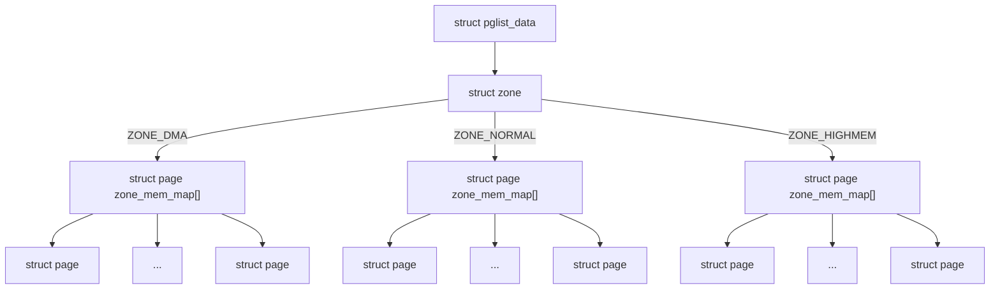
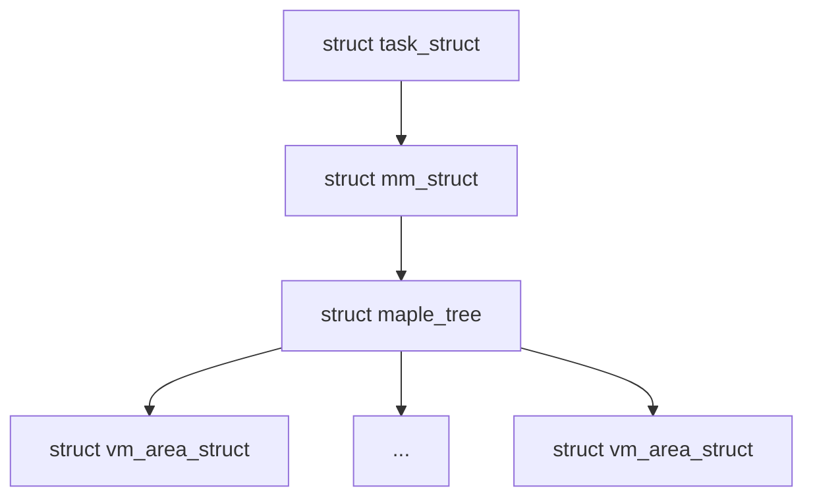
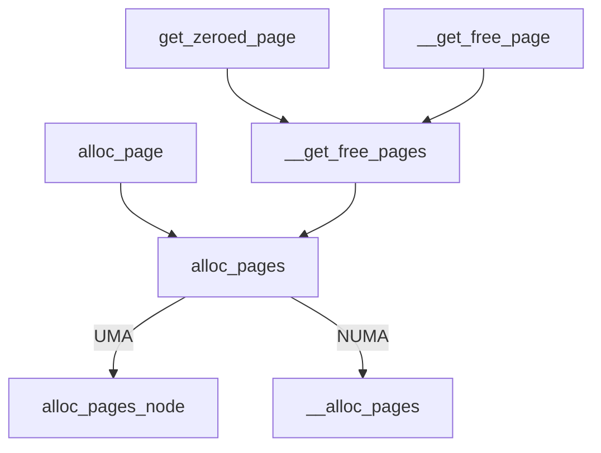
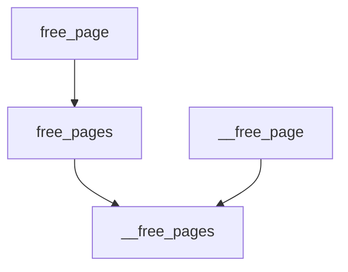

# Material

-   [Linux物理内存描述](http://ilinuxkernel.com/?p=1332) 
-   [Linux物理内存页面分配](http://ilinuxkernel.com/?p=1371) 

# 1 前置概念

## 1.1 (N)UMA模型

-   UMA模型（一致内存访问，uniform memory access）：将可用内存以连续方式组织起来（可能有小的缺口）。SMP系统中的每个处理器访问各个内存区的速度都是一样的。
-   NUMA模型（非一致内存访问，non-uniform memory access）：系统的各个CPU都有本地内存，可支持特别快速的访问。各个处理器之间通过总线连接起来，以支持对其他 CPU的本地内存的访问，比访问本地内存慢些。


Linux 根据访问内存的速度是否一致，定义了 **节点（Node）** 的概念。节点通过 `struct pglist_data` 结构体来表示，这个结构体后面章节有详细的介绍。

### 1.1.1 UMA 节点

在 UMA 模型中，所有的物理内存被认为是统一访问时间的，因此系统中只存在一个节点，编号为 `0`。UMA模型的节点定义了一个全局变量 `mm/memblock.c:contig_page_data`，并通过 `NODE_DATA(0)` 来使用它

```c
/* include/linux/mmzone.h */
#ifndef CONFIG_NUMA
extern struct pglist_data contig_page_data;
static inline struct pglist_data *NODE_DATA(int nid)
{
    return &contig_page_data;
}
#endif
```

### 1.1.2 NUMA节点

在 NUMA 模型中，内核使用一个数组或指针数组来管理多个 `pglist_data`，每个节点对应一个 `pglist_data`，通过 `NODE_DATA(nid)` 获取。

```c
/* arch/x86/mm/numa.c */
struct pglist_data *node_data[MAX_NUMNODES] __read_mostly;
```

## 1.2 虚拟地址VS物理地址

-   虚拟地址
    -   **一般内存分配**：通过 `kmalloc()`、`kmem_cache_alloc()` 等函数分配内存时，返回的是虚拟地址。内核代码使用这些虚拟地址进行访问。
    -   **内存映射 I/O**：通过 `ioremap()` 等函数将物理设备的地址映射到虚拟地址空间。
-   物理地址
    -   **DMA 操作**：使用 `dma_alloc_coherent()` 等函数分配内存，返回的是物理地址，设备通过 DMA 直接访问这些物理地址。
    -   **硬件设备访问**：某些设备驱动可能需要直接使用物理地址来访问设备内存或进行低级硬件操作。

## 1.3 内存信息查看

```bash
$ cat /proc/zoneinfo        # 显示每个 Zone 的详细信息
$ cat /proc/pagetypeinfo    # 显示每种页类型的可用情况
$ cat /proc/buddyinfo       # 伙伴系统的状态
```

# 2 内存相关struct

## 2.1 物理内存



### 2.1.1  struct pglist_data

`include/linux/mmzone.h:struct pglist_data` 还有一个别名 `pg_data_t` ，用来描述一个节点（Node）。可以通过 `NODE_DATA(nid)`  访问当前 CPU 所在节点的 `pglist_data` 。

```c
typedef struct pglist_data {
    struct zone       node_zones[MAX_NR_ZONES];      /* 该节点上的所有内存区域（zone），如 DMA/Normal/HighMem */
    struct zonelist   node_zonelists[MAX_ZONELISTS]; /* 页面分配器使用的 zone 路径链表 */
    int               nr_zones;                      /* 当前节点中实际被初始化的 zone 数量 */
    unsigned long     node_start_pfn;                /* 该节点内存的起始页帧号（PFN） */
    unsigned long     node_spanned_pages;            /* 该节点内所有 zone 覆盖的总页数（含 holes） */
    unsigned long     node_present_pages;            /* 该节点中实际存在（online）的页数 */
    struct page       *node_mem_map;                 /* 指向该节点所拥有页框的 struct page 数组基址 */
    int               node_id;                       /* 该节点的编号 */
    wait_queue_head_t pfmemalloc_wait;               /* 内存紧张时，pfmemalloc 机制的等待队列 */
    spinlock_t        lru_lock;                      /* 保护 LRU 列表（页面回收相关）用的自旋锁 */
    ...
} pg_data_t;
```

### 2.1.2 struct zone

节点（Node）下面可以有多个区域， 每个区域的类型不同，用 `include/linux/mmzone.h:zone_type` 表示

```c
enum zone_type {
    ZONE_DMA,     /* 提供给某些只能访问低地址内存的设备（通常为 < 16MB）。主要用于 DMA 设备需要的缓冲区 */
    ZONE_DMA32,   /* 为只能访问 32 位地址（<4GB）的设备提供内存 */
    ZONE_NORMAL,  /* 内核的主工作区。用于分配常规内存（内核堆、页表、结构体等）*/
#ifdef CONFIG_HIGHMEM
    ZONE_HIGHMEM, /* 高端内存：无法直接线性映射到内核地址空间，需要临时映射。仅 32 位系统使用 */
#endif
    ZONE_MOVABLE, /* 可移动页，用于页迁移、内存热插拔等 */
#ifdef CONFIG_ZONE_DEVICE
    ZONE_DEVICE,  /* 专供设备内存管理（如 NVDIMM、GPU）使用 */
#endif
    __MAX_NR_ZONES
};
```

对一台 64GB 内存机器而言，Linux 内核可能会将物理内存划分为：

```bash
[   0   - 16MB  ]  ->  ZONE_DMA
[  16MB - 4GB   ]  ->  ZONE_DMA32
[  4GB  - 64GB  ]  ->  ZONE_NORMAL
[      移动页    ]  ->  ZONE_MOVABLE
```

`include/linux/mmzone.h:struct zone` 用于管理该 zone 内的物理页框（`struct page`）的分配、回收、迁移等。

```c
struct zone {
    unsigned long          _watermark[NR_WMARK];   /* 内存水位线，触发页回收、kswapd 等机制的先决条件 */
    unsigned long          watermark_boost;        /* 用于内存回收时动态调高水位，以缓解内存紧张 */
    unsigned long          nr_reserved_highatomic; /* 为高优先级分配（GFP_ATOMIC）保留的页数 */
    long                   lowmem_reserve[MAX_NR_ZONES];  /* 为高 zone（如 ZONE_NORMAL）保留内存，
                                                             防止被低 zone（如 ZONE_DMA）抢光 */
    struct per_cpu_pageset *per_cpu_pageset;       /* 每个 CPU 的本地页缓存，减少锁竞争，提高性能 */

    struct pglist_data     *zone_pgdat;            /* 指回所属的 struct pglist_data（即 NUMA 节点）*/
    struct page            *zone_mem_map;          /* 指向该 zone 的起始 struct page 数组 */
    
    struct free_area       free_area[MAX_ORDER];   /* 按 2^order 管理的 free list（伙伴系统）*/
    ...
};
```

### 2.1.3 struct page

`struct page` 是 Linux 内核中用于描述每一页物理内存的核心数据结构。它在物理内存管理（包括页面分配、换页、缓存管理等）中起着基础性作用。在虚拟内存场景下，在 32 位系统下启用了高端内存时，使用非常频繁且关键。

```c
struct page {
    unsigned long flags;               /* 页的状态标志 */
    struct folio *folio;               /* 指向所属 folio（5.18 之后逐步引入）*/
    union {
        struct address_space *mapping; /* 映射地址空间（文件页、页缓存）*/
        void *s_mem;                   /* Slab 页的对象空间起始地址 */
        ...
    };
    union {
        pgoff_t index;                 /* 页在文件中的偏移（page cache）*/
        void *freelist;                /* 用于 Slab 分配器 */
    };
    union {
        struct list_head lru;          /* LRU 链表 */
        struct {                       /* 或者用于 Slab 链表 */
            struct page *next;
        };
    };
    atomic_t _mapcount;                /* 页被映射的次数（匿名映射）*/
    atomic_t _refcount;                /* 页的引用计数 */
    ...
    struct zone *zone;                 /* 所属 zone（间接编码，某些内核不直接暴露）*/
};
```

`struct page`是内核在启动时为 **所有物理页一次性分配的大块结构体数组**，如：`memblock_alloc(sizeof(struct page) * nr_pages, ...);`  

## 2.2 虚拟内存



### 2.2.1 struct vm_area_struct

`include/linux/mm_types.h:struct vm_area_struct` 是操作系统中管理进程虚拟地址空间的核心数据结构，用于描述进程地址空间中一段**连续**的**虚拟内存**区域。每个VMA代表具有相同属性（如权限、映射类型等）的内存段，支持高效的内存管理和保护机制。

```c
struct vm_area_struct {
    unsigned long vm_start;     /* 虚拟地址空间中的起始地址 */
    unsigned long vm_end;       /* 虚拟地址空间中的结束地址 */

    struct mm_struct *vm_mm;    /* 指向所属进程的内存描述符 struct mm_struct，关联到进程的整个地址空间 */
    
    
    struct file * vm_file;      /* 文件映射，指向关联的 struct file 对象；匿名映射（如堆、栈）时此字段为 NULL */
    unsigned long vm_pgoff;     /* 文件映射的页偏移量（以页大小 PAGE_SIZE 为单位），对应于mmap()的最后一个参数。
                                   例如，vm_pgoff=2 表示从文件的第 3 页开始映射 */
    unsigned long vm_flags;     /* 控制内存区域的共享性、可执行性等行为(如 VM_READ|VM_WRITE|VM_EXEC|VM_SHARED) */
    struct vm_operations_struct *vm_ops; /* 操作函数集 */
    void * vm_private_data;     /* 用于存储 VMA 的私有数据 */
    ...
}
```

### 2.2.2 struct mm_struct

`include/linux/mm_types.h:struct mm_struct` 结构是描述内存管理的基本单位，`include/linux/sched.h:struct task_struct` 结构中会包含它。

```c
struct task_struct {
    ...
    struct mm_struct *mm;        /* 当前用户进程拥有的地址空间 */
    struct mm_struct *active_mm; /* 当前用户进程实际使用的地址空间，包括内核线程+继承自前一个任务 */
    ...
};
```

`mm_struct` 通过 `struct maple_tree` 与 `vm_area_struct` 关联在一起。

```c
struct mm_struct {
    struct maple_tree mm_mt;
    unsigned long     mmap_base;
    unsigned long     mmap_legacy_base;
    pgd_t             *pgd;
}
```

# 3 内存相关API

## 3.1 页面分配

| APIs                         | 描述                                              |
| ---------------------------- | ------------------------------------------------- |
| alloc_page(gfp_mask)         | 分配一个页面，返回页面数据结构                    |
| alloc_pages(gfp_mask, order) | 分配 $2^{order}$ 个页面，返回第一个页面的数据结构 |
| __get_free_page(gfp_mask)    | 分配一个页面，且返回页面的逻辑地址                |
| __get_free_pages(gfp_mask)   | 分配 $2^{order}$ 个页面，且返回页面的逻辑地址     |
| get_zeroed_page(gfp_mask)    | 分配 1 个页面，数据清零、且返回逻辑地址           |



## 3.2 页面回收

| APIs                      | 描述                                          |
| ------------------------- | --------------------------------------------- |
| __free_pages(page, order) | 释放 $2^{order}$ 个页面，第一个参数为物理地址 |
| __free_page(addr)         | 释放第一个参数指定的物理地址的内存            |
| free_pages(addr, order)   | 释放 $2^{order}$ 个页面，第一个参数为逻辑地址 |
| free_page(addr)           | 释放第一个参数指定的逻辑地址的内存            |



## 3.3 虚拟内存

| APIs                                     | 描述                                                         |
| ---------------------------------------- | ------------------------------------------------------------ |
| kmalloc()                                | 内核空间返回一块虚拟内存，且物理地址和虚拟地址都保证连续，最大分配大小通常小于 128 KB |
| kmem_cache_create() / kmem_cache_alloc() | Slab 分配器为相同大小的对象创建cache，这个大小一般限制在8K~32K，依系统而异 |
| mempool_create()                         | 内存池接口，保证关键路径（如中断、I/O 等）中的内存分配请求不会失败 |
| vmalloc()                                | 内核空间返回一块虚拟内存，虚拟地址连续但物理地址不一定连续   |

# 4 初始化内存管理

`init/main.c:start_kernel()` 中与内存管理相关的初始化如下

```c
asmlinkage __visible void __init __no_sanitize_address start_kernel(void)
{
    ...
    page_address_init();                  /* 初始化页框到虚拟地址的映射缓存 */
    setup_arch(&command_line);            /* 早期体系结构初始化函数 */
    setup_per_cpu_areas();                /* 初始化每个 CPU 分配独立的内存区域（per-CPU 数据）*/
    build_all_zonelists(NULL);            /* 初始化所有 zone 的 zonelist 链表 */
	page_alloc_init();                    /* 初始化伙伴系统中的 free_area 管理结构 */
    mm_init();                            /* 进一步初始化内核内存子系统 */
    setup_per_cpu_pageset();              /* 初始化每个 CPU 的 per-CPU 页面缓存 */
    ...
}
```

## 4.1 page_address_init

从 Linux 6.0 的源码以及gdb调试追踪来看，这个函数最终实现为空，估计是为了兼容以前的代码。

```c
#define page_address_init()  do { } while(0)
```

## 4.2 setup_arch

`arch/x86/kernel/setup.c:setup_arch()` 负责体系结构相关的初始化函数，其主要任务包括：

-   硬件基础检测与初始化
-   内存管理初始化
-   引导参数解析
-   中断与异常处理
-   体系结构特有配置

下面会重点关注与内存管理相关部分的实现。

### 4.2.1 init_mem_mapping

`arch/x86/mm/init.c:init_mem_mapping()`  建立物理内存到内核虚拟地址的直接映射，将物理地址 `0x0` 到 `max_pfn << PAGE_SHIFT` 映射到内核虚拟地址空间的 `PAGE_OFFSET` 起始区域。

这其中最关键的调用是 `memory_map_bottom_up()` 或 `memory_map_top_down()` ，它会遍历内存区域，逐段调用 `init_memory_mapping()`。最终将已经被内核页表映射的物理页帧号区间保存到 `arch/x86/mm/init.c:pfn_mapped[]` 中。

```c
void __init init_mem_mapping(void)  /* 只罗列关键步骤 */
{
    probe_page_size_mask();         /* 探测 CPU 支持的页大小（如 2MB/1GB 大页）*/
    
#ifdef CONFIG_X86_64
    end = max_pfn << PAGE_SHIFT;    /* 64 位使用 max_pfn（所有物理内存）*/
#else
    end = max_low_pfn << PAGE_SHIFT;/* 32 位使用 max_low_pfn（低端内存）*/
#endif
    
    init_memory_mapping(0, ISA_END_ADDRESS, PAGE_KERNEL); /* 初始化 ISA 地址范围 [0,0x100000] */
    init_trampoline();              /* 初始化跳板页表（用于 KASLR 偏移）*/
    
    
    if (memblock_bottom_up()) {     /* 自底向上映射 */
        unsigned long kernel_end = __pa_symbol(_end);
        memory_map_bottom_up(kernel_end, end);
        memory_map_bottom_up(ISA_END_ADDRESS, kernel_end);
    } else {                        /* 自顶向下映射, X86进入的是这个分支 */
        memory_map_top_down(ISA_END_ADDRESS, end);
    }
    ...
}
```

### 4.2.2 initmem_init

`arch/x86/mm/numa_64.c:initmem_init()` 初始化系统的 NUMA 结构、节点内存信息、距离矩阵等，为后续调度器和内存分配器提供 NUMA 拓扑信息支持。

## 4.3 setup_per_cpu_areas

`arch/x86/kernel/setup_percpu.c:setup_per_cpu_areas()` 是 Linux 内核启动阶段的重要函数之一，其主要作用是为每个 CPU 分配和初始化 per-CPU（每 CPU 私有）数据区域，并设置相应的访问机制。

 `__per_cpu_offset[]` 记录了每个 CPU 的 per-CPU 数据块相对于基地址的偏移，供 `__percpu` 变量访问使用。

## 4.4 build_all_zonelists

`mm/page_alloc.c:build_all_zonelists()` 会（重新）构建系统中的所有 **zone 列表（zonelists）**。

```c
struct zoneref {
	struct zone *zone;  /* 指向实际的 zone */
	int zone_idx;       /* zone 在节点中的索引，如 ZONE_NORMAL */
};
struct zonelist {
	struct zoneref _zonerefs[MAX_ZONELISTS * MAX_NR_ZONES + 1];
};
```

每个 `pg_data_t`（代表一个 NUMA 节点）包含多个 `zonelist`，每个 zonelist 表示某种内存分配策略（如 `GFP_KERNEL`）的搜索路径。

```c
pg_data_t->node_zonelists[0] → zonelist
                             ├── zoneref: ZONE_NORMAL (当前节点)
                             └── zoneref: ZONE_NORMAL (其他节点)
```

## 4.5 page_alloc_init

`mm/page_alloc.c:page_alloc_init()` 初始化每 CPU 页分配子系统的热插拔支持，确保在 CPU 上线/下线时正确初始化和清理每 CPU 页缓存，保证伙伴系统的正确性和高效性。

## 4.6 mm_init

`init/main.c:mm_init()` 完成早期内存系统初始化，包括页扩展机制、调试与硬化工具、堆栈收集、分配器（SLAB/SLUB）、vmalloc 映射、内存泄露/越界检测，以及页表和 PTI 安全机制，标志着内核正式启用完整内存管理体系。

### 4.6.1 mem_init

`arch/x86/mm/init_64.c:mem_init()` 启用伙伴系统（buddy allocator），正式开始物理页分配。

```c

```


此处会初始化 mem_map，指向（或代表）整个系统中所有物理页面的 `struct page` 结构体数组。

```bash
start_kernel()
└── setup_arch()
    └── init_mem_mapping()           // 初始化物理内存映射
└── mm_init()
    └── mem_init()
        └── alloc_node_mem_map()     // 为每个节点分配 mem_map 数组
            └── pgdat->node_mem_map = memblock_alloc(...)
```

PFN和每个页帧的对应关系：

```c
struct page *page = pfn_to_page(pfn);
unsigned long pfn = page_to_pfn(page);
```

### 4.6.2 kmem_cache_init


### 4.6.3 pgtable_init


### 4.6.4 vmalloc_init


## 4.7 setup_per_cpu_pageset

`mm/page_alloc.c:setup_per_cpu_pageset()` 初始化每个 zone 的 per-CPU pageset，并为每个节点分配每 CPU 的 node 级统计结构体（per_cpu_nodestat），为后续高效的页分配与内存事件统计做好准备。

# 5 物理内存的管理

## 5.1 伙伴系统

### 5.1.1 空闲页面的管理

https://github.com/godspeed1989/buddy_allocator

[Linux物理内存描述 ](file:///C:/N-20W1PF3L7KWX-Data/shupliu/Desktop/%E4%BC%99%E4%BC%B4%E7%B3%BB%E7%BB%9F/Linux_Physical_Memory_Description.pdf) 

[Linux物理内存页面分配](file:///C:/N-20W1PF3L7KWX-Data/shupliu/Desktop/%E4%BC%99%E4%BC%B4%E7%B3%BB%E7%BB%9F/Linux_Physical_Memory_Page_Allocation.pdf) 

# 6 虚拟内存的管理

## 6.1 内存映射mmap

