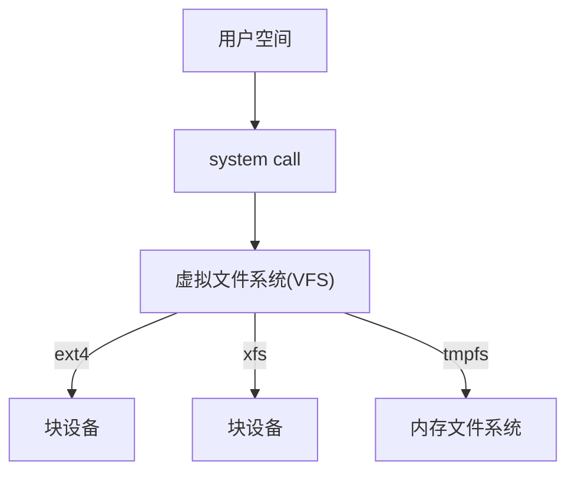

# Material

-   [Linux虚拟文件系统](http://ilinuxkernel.com/?p=1812) 

# 1 Virtual File System

# 2 File System

# 3 页缓存和块缓存

-   [顶级程序员的魅力！linux Uncached buffer IO使文件系统性能提升65%](https://zhuanlan.zhihu.com/p/7485748615) 

